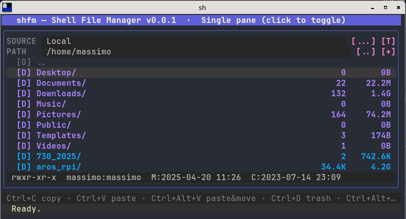

# shfm — Shell File Manager v0.0.3

An interactive terminal file manager written in pure Go, built on
[bubbletea v2](https://github.com/charmbracelet/bubbletea) (Elm architecture)
and [lipgloss v2](https://github.com/charmbracelet/lipgloss) for the UI.

It talks **directly to the hardware and to remote protocols** — removable
media (mounted via udisks2 D-Bus, no root needed), **MTP** devices
(smartphones/cameras over raw USB), **SMB**, **NFS** and **SFTP** — all in
Go, never shelling out to external commands for them (`mount`, `smbclient`,
`udisksctl`, `ssh`...). Every protocol but MTP is pure Go with no C
dependency; MTP uses [`github.com/hanwen/go-mtpfs`](https://github.com/hanwen/go-mtpfs)
for the PTP/MTP protocol itself, which requires cgo and `libusb-1.0` for
the underlying USB transport.

The only external programs shfm ever runs are: the desktop's default
application, when you open a file; `pkexec`, to elevate a permission-denied
operation (see [Notes](#notes)); and, only for the optional semantic
content search, `pandoc`, `libreoffice`/`soffice`, `xz` and `7z` when they
happen to be installed.



## Layout

Each pane shows, top to bottom: the **SOURCE** field (the active source —
local disk, removable device, MTP, SMB, NFS or SFTP) with a `[...]` button
to change it and a `[T]` button to toggle the trash view; the **PATH**
field (the current path, directly editable) with a `[..]` button to go up
one folder and a `[+]` button to create a new file or folder; the file
list (with a `.. ` entry at the top to go up, besides the button); a
per-pane **detail line** showing the permissions, owner, group and
modification/creation dates of whichever entry is currently under that
pane's cursor (a file, folder, or symlink), updating as the cursor moves;
and, shared below both panes even in **dual-pane** mode, a single summary
help line with the main shortcuts. Click the title bar, or press Ctrl+L,
to toggle between single- and dual-pane layout.

## Features

- **Single or dual pane**, toggled with `Ctrl+L` or a click on the title
  bar (preference saved to disk).
- **No function keys**: every shortcut uses `Ctrl` (and `Ctrl+Alt` for
  "alternative" variants), designed for modern keyboards where F1-F12 are
  often missing or hard to reach.
- **Full keyboard and mouse navigation**, including real **drag&drop**:
  drag one or more items (even a multi-selection) onto a folder — in the
  same pane or the other one — to move them; hold `Ctrl` while releasing
  to copy instead. Every interactive element (SOURCE/PATH fields, `[...]`/
  `[T]`/`[..]`/`[+]` buttons, menu entries) is clickable.
- **Multi-selection**: `Space` to toggle, `a`/`A` to select all/none,
  `Ctrl`+click for a single entry, `Shift`+click for a range.
- **Copy, paste (as a copy or moving), delete, rename, new file, new
  folder**, even across different sources (local ↔ SMB ↔ NFS ↔ SFTP ↔
  MTP), via streaming when no more efficient native operation is
  available.
- **Background tasks with progress**: copy/move/delete run as background
  tasks with a live progress dialog; closing it (`Esc`) just sends the
  task to the background — it keeps running. `Ctrl+B` opens the list of
  background tasks, to check on or reopen any of them. Quitting while
  tasks are still running shows a warning first.
- **Desktop notifications for backgrounded tasks**: a task sent to the
  background (`Esc`) that then finishes — successfully, with errors, or
  cancelled — while you're not watching its progress dialog posts a
  desktop notification, via the standard `org.freedesktop.Notifications`
  D-Bus interface (works with any DE/WM's notification daemon — mako,
  dunst, swaync, GNOME Shell, Plasma, xfce4-notifyd... — no external
  `notify-send` binary needed). A task still open in its progress dialog
  when it finishes doesn't also get a notification, since you're already
  looking at it. Set `"notifications": false` in
  `$XDG_CONFIG_HOME/shfm/config.json` to opt out entirely.
- **Clipboard shared with the desktop (Wayland)**, both ways: items
  copied with `Ctrl+C` can be pasted in other applications (a graphical
  file manager, an editor...) as file URIs — `file://` for local files,
  `smb://`, `sftp://`, `nfs://`, `mtp://` for the other sources — and
  files copied in another application are what `Ctrl+V` (copy) /
  `Ctrl+Alt+V` (move) paste in shfm, until something is copied in shfm
  again; the shfm key always decides between copy and move. Pasted
  network/MTP URIs are read from a pane that has that source open, else
  from a saved source (connected in the background just for the
  transfer). Implemented natively over the compositor's data-control
  protocol (`internal/wlclip`, no `wl-copy`/`wl-paste` needed): works on
  wlroots compositors (labwc, sway, Hyprland...) and KDE Plasma; elsewhere
  it quietly stays off. What shfm copies stays on the clipboard while shfm
  runs. On by default; set `"share_clipboard": false` in
  `$XDG_CONFIG_HOME/shfm/config.json` to keep the clipboard private.
- **Colored listing** by file type (folders, symlinks, executables,
  archives, images, media) and by permissions (read-only entries are
  shown in a fainter shade).
- **Per-pane detail line**: permissions (`rwx` for user/group/others,
  followed by `[immutable]` / `[append-only]` when the entry carries such a
  `chattr` flag), owner, group, and modification/creation dates for whichever entry is
  under that pane's cursor, always shown just above the shared help line —
  independent per pane, so each side can inspect a different entry at
  once. Creation date is populated (on local files only, via a single
  cheap `statx(2)` call per cursor move, never a directory walk) when the
  filesystem records one — not every one does (e.g. tmpfs), in which case
  it's shown as `-`.
- **Folder sizes and item counts**: on the local filesystem, folders show
  their total recursive content size and item count (files and subfolders
  combined), just like files show their size, computed **in the
  background** (a goroutine per folder) so opening a directory is never
  blocked by it — each folder shows `?`/`?B` until ready, then updates in
  place.
- **Open with the default application**: `Enter`/double-click on a file
  opens it with the desktop's configured default app (via the XDG MIME
  Applications spec); if none is set, a chooser lists installed
  applications and remembers the pick for next time.
- **Properties dialog** (`i`): view type, size, modification date,
  permissions, owner and group (plus any `immutable`/`append-only` `chattr`
  flag, on the local filesystem); on backends that support it (local
  filesystem, SFTP), edit permissions (octal), owner and group directly.
- **Automatic elevation for permission-denied operations** (Linux only):
  chmod/chown (Properties dialog), delete and move/rename on the *local*
  filesystem go straight to `pkexec` when shfm can already tell, from the
  standard Unix owner/group/other permission model, that the plain attempt
  would fail — e.g. editing, deleting or moving something owned by root —
  and fall back to it reactively (as before) if a permission error still
  turns up unexpectedly. No extra dialog of shfm's own: `pkexec`'s native
  authentication prompt is the only interruption, and only appears when
  actually needed. See [Notes](#notes) for exactly how this is scoped.
- **Search/filter by name** (`/`): live substring match (case-insensitive)
  in the current folder as you type; `Tab` switches to full regex
  matching, `Ctrl+R` switches from filtering the current folder to a
  background recursive search of the whole subtree (applied on `Enter`,
  not live, to avoid re-walking a large or remote tree on every
  keystroke).
- **Semantic (content) search** (`Ctrl+F`, optional): finds files by what
  they *say*, not by their name, using a local Qwen3 embedding model (and,
  optionally, a reranker) — no network, nothing leaves the machine. Not part
  of the base build: see [Optional: semantic (content) search](#optional-semantic-content-search).
- **Trash compliant with the Freedesktop.org Trash Specification 1.0**:
  "home" trash (`$XDG_DATA_HOME/Trash`) and "top directory" trash cans for
  external devices, restore (`R`), empty (`e` in the trash view, opened
  with `T`).
- **Source picker** (`Ctrl+S`, or a click on the SOURCE field/`[...]`
  button): lists, live, local disks, **removable USB/SD devices** (even
  unmounted ones — mounted automatically, preferring the system's
  **udisks2** D-Bus service, the same mechanism GNOME/Nautilus/Thunar
  use, so a regular local user can mount/unmount without root; falls back
  to a direct `mount(2)` syscall if udisks2 is unavailable), **MTP
  devices** (detected and driven over USB via `github.com/hanwen/go-mtpfs`,
  see [Notes](#notes)), and saved **SMB**/
  **NFS**/**SFTP** sources. New SMB, NFS or SFTP connections can be
  created from the same menu; SMB and SFTP passwords, if entered, are
  saved **encrypted at rest** (AES-256-GCM, key derived from the
  machine/user — see `internal/secret`) instead of being discarded or
  stored in plain text. SFTP host keys are verified/recorded via
  `~/.ssh/known_hosts` (trust-on-first-use, like OpenSSH). Connecting to
  MTP/SMB/NFS/SFTP always happens **in the background**: a "Connecting…"
  placeholder appears immediately and the rest of shfm stays fully
  responsive no matter how long the USB/network I/O takes (a slow or
  unresponsive device can never freeze the UI); dismissing it (Esc) just
  stops watching — the attempt keeps running and is applied whenever it
  completes, wherever the pane that requested it ends up being.
- **Automatic one-way mirrors**: copy a file or folder (`Ctrl+C`), then
  paste it as a mirror with `Ctrl+Alt+M` — after a confirmation dialog
  showing source → destination, the destination is kept **identical** to
  the source (recursively, deletions included): synced right away, then
  every 5 minutes while shfm runs and both ends are available. A local
  disk or removable drive counts as available while mounted (recognized by
  its filesystem UUID, wherever it gets mounted), a network or MTP source
  while a pane has it open. Between local sources you can choose the
  **rsync delta-transfer** algorithm (only changed blocks are written;
  runs in-process via a patched copy of
  [`gokrazy/rsync`](third_party/gokrazy-rsync), no `rsync` binary needed)
  or a generic whole-file copy; any other combination uses the generic
  one. `Ctrl+Alt+M` with an empty clipboard lists the saved mirrors (sync
  now, pause/resume, delete).
- **Format a removable source**: pick exFAT, FAT32, ext4 or XFS, via a
  dedicated dialog with a red data-loss warning followed by a second,
  explicit "type YES to proceed" confirmation. Refuses to format the disk
  the system itself is running from, as a hard safety rail on top of the
  UI confirmations. Implemented over udisks2 D-Bus (`Block.Format` /
  `PartitionTable.CreatePartition`), the same mechanism GNOME Disks uses.
- **Desktop launcher entry**: on first run, shfm installs a `shfm.desktop`
  file so it shows up in your desktop environment's application menu —
  system-wide (`/usr/share/applications`) if run as root, per-user
  (`~/.local/share/applications`) otherwise — but only if neither already
  exists.

## Keyboard shortcuts

No function keys by default: everything goes through `Ctrl` (and
`Ctrl+Alt` for alternative variants). The help line under each file list
summarizes the main ones; `Ctrl+Alt+H` (or `?`) shows the full list —
generated live from whatever is actually bound, so it's always accurate
even after rebinding (see below), not a separate hardcoded reference.

| Key | Action |
|---|---|
| `Ctrl+Up` / `Ctrl+Down` (also `Up`/`Down`, `k`/`j`) | move the cursor in the list |
| `PgUp` / `PgDown` | move the cursor one page up/down |
| `Home` / `g`, `End` / `G` | jump to the first / last entry |
| `Left` / `Right`, `Tab` | switch active pane (dual-pane) |
| `Enter` / double-click | open (folder, or file with its default app) |
| `Backspace` / `h` | go up one folder |
| `Ctrl+P` / click PATH | edit the path directly |
| `Ctrl+S` / click SOURCE | open the source picker |
| `Ctrl+L` / click title | toggle single/dual pane |
| `Space`, `a`, `A` | multi-selection |
| `Ctrl+C` | copy to clipboard |
| `Ctrl+V` | paste (as a copy) |
| `Ctrl+Alt+V` | paste, moving instead |
| `Ctrl+D` | move to trash |
| `Ctrl+Alt+D` | delete permanently |
| `Ctrl+Alt+M` | paste as an automatic mirror (empty clipboard: list mirrors) |
| `r`, `m`, `f` | rename, new folder, new file |
| `i` | properties (permissions, owner, group) |
| `/` | search/filter the current folder by name |
| `Esc` | cancel a search/filter or close a dialog |
| `Ctrl+F` | semantic search on file contents (optional, needs a special build: see [Optional: semantic (content) search](#optional-semantic-content-search)) |
| `T`, `R`, `e` | open/close trash, restore (`R` refreshes outside the trash), empty the trash (in the trash view) |
| `Ctrl+B` | background tasks |
| `Ctrl+Alt+H` / `?` | full list of shortcuts |
| `q` / `Ctrl+Q` | quit |

### Customizing keybindings

Every shortcut above is configurable via
`$XDG_CONFIG_HOME/shfm/keybindings.conf` (`~/.config/shfm/...` by
default). shfm works out of the box without it — on first run, it
auto-creates this file with every default binding and a short comment
explaining what it does, so there's always something concrete to edit:

```
quit                 = q, ctrl+q              # Quit the application
cursor-up            = ctrl+up, up, k         # Move cursor up
...
```

One shortcut per line: `<action> = <key>[, <key>...]`. Remove the keys
after `=` (leave it blank) to disable a shortcut entirely; the space bar
is written as `space`; modifiers can be given in any order (`ctrl+alt+v`
and `alt+ctrl+v`, as older shfm versions wrote it, are the same key); lines starting with `#`, and any line naming an
action shfm doesn't recognize, are ignored rather than treated as errors.
Restart shfm after editing. The in-app help (`Ctrl+Alt+H` / `?`) always
reflects the current file, since both read from the same configuration.

## Building

shfm currently works, and is tested, only on **GNU/Linux**. Requires
**Go ≥ 1.27** (the version in `go.mod`). MTP support needs
cgo and the `libusb-1.0` development headers (e.g. `libusb-1.0-0-dev` on
Debian/Ubuntu, `libusb` on Arch) plus a C compiler (`gcc`).

```sh
go build -o shfm .
./shfm
```

Both panes open on your home folder by default; pass a folder as the one
optional argument (`./shfm /mnt/data`) to open there instead. An invalid
argument (missing, not a directory, ...) is silently ignored in favor of
the home-folder default rather than refusing to start.

This is the base build: everything except semantic (content) search. For
a build with **every feature enabled**, including semantic search with
Vulkan GPU acceleration, see [Full build](#full-build-every-feature-vulkan-gpu-acceleration)
below.

To connect to NFS exports that require a privileged source port (see
[Notes](#notes)), optionally run this after building:

```sh
sudo setcap 'cap_net_bind_service=+ep' ./shfm
```

The capability is stored on the binary file itself, so **it is lost every
time `shfm` is rebuilt**: run the command again after each `go build`.

### Full build: every feature, Vulkan GPU acceleration

Everything in one place; each step is explained in [Optional: semantic
(content) search](#optional-semantic-content-search) and [GPU
acceleration](#gpu-acceleration) below. On Arch/Manjaro (other
distributions: the equivalent packages; the Vulkan driver is the one for
your GPU, e.g. `vulkan-radeon`, or NVIDIA's own):

```sh
# 0. Toolchain and Vulkan development files
sudo pacman -S go base-devel cmake git libusb \
               vulkan-headers spirv-headers shaderc vulkan-icd-loader \
               vulkan-intel intel-gpu-tools   # intel-gpu-tools: optional, GPU load monitor (Intel only)

# 1. llama-go: upstream, pinned to the commit this project's patches target,
#    merged into third_party/llama-go WITHOUT overwriting the four patched
#    files already there (cp -n), then built with the Vulkan backend
UP=$(mktemp -d)
git clone --recursive https://github.com/tcpipuk/llama-go "$UP"
git -C "$UP" checkout 992bbf8
git -C "$UP" submodule update --init --recursive
rm -rf "$UP/.git" "$UP/llama.cpp/.git"
cp -an "$UP"/. third_party/llama-go/ && rm -rf "$UP"
(cd third_party/llama-go && CMAKE_BUILD_PARALLEL_LEVEL=8 BUILD_TYPE=vulkan make libbinding.a)
#    (about 5 minutes with 8 jobs; cmake builds serially unless told otherwise)

# 2. Workspace pointing at it (skip if go.work already exists), then shfm
#    with semantic search and the Vulkan libraries linked in
go work init . && go work use ./third_party/llama-go
go build -tags "semantic vulkan" -o shfm .

# 3. Allow NFS exports that require a privileged source port
#    (repeat after every rebuild)
sudo setcap 'cap_net_bind_service=+ep' ./shfm
```

Then provide the embedding model (and optionally the reranker) as described
in steps 3 and 4 of the semantic-search section below. The `-tags` must
match how the libraries in step 1 were built (see the table under
[GPU acceleration](#gpu-acceleration)); for a CPU-only build use plain
`make libbinding.a` and `go build -tags semantic -o shfm .` instead.

Removable-device, MTP and disk-formatting support is Linux-only (it
relies on `/sys/block`, `/sys/bus/usb`, `libusb`, and the udisks2
D-Bus service): on other platforms those menu entries simply don't
appear, the rest of the application is unaffected. That is only how the
code is organised, though (Linux-specific parts sit behind build tags, with
no-op fallbacks elsewhere): **shfm currently works, and is tested, only on
GNU/Linux** — no other platform is supported.

### Installing

shfm is a single binary: copy it into a directory on `$PATH` and run it.

```sh
sudo install -m 755 shfm /usr/bin/shfm
sudo setcap 'cap_net_bind_service=+ep' /usr/bin/shfm   # optional, see above; repeat after every update
```

On first run shfm creates its own `shfm.desktop` launcher, so it appears in
the desktop's application menu — nothing else to install. It is written
per-user to `~/.local/share/applications/` (or `$XDG_DATA_HOME/applications/`)
when run as a normal user, or system-wide to `/usr/share/applications/` when
run as root, with `Exec=` pointing at the binary's own path. It is only
created if no `shfm.desktop` exists yet, and never rewritten: if you later
move the binary, delete the old `shfm.desktop` and it is regenerated on the
next run.

### Optional: semantic (content) search

`Ctrl+F` — semantic search over file *contents* (TXT/Markdown/LaTeX/PDF/
DOCX always; DOC/RTF/ODT too if `pandoc` and/or `libreoffice` are found
installed — see below; ZIP/TAR/TAR.GZ/TAR.BZ2 archives always, plus
TAR.XZ/7Z if `xz`/`7z` are found too — see further below), as opposed to
`/`'s search over file *names* — is a self-contained,
removable module (`internal/semantic/`) compiled in only with the
`semantic` build tag. The plain `go build -o shfm .` above never touches
it, needs none of its dependencies, and the resulting binary is identical
to a build with no AI features at all — `internal/semantic` (and this
whole section) can be removed with no effect on the rest of shfm beyond
deleting its single call site, `internal/ui/semanticsearch.go`, and the
few lines in `internal/ui/model.go` that create the engine.

Building it for real needs substantially more than `-tags semantic`,
because its LLM backend, [`github.com/tcpipuk/llama-go`](https://github.com/tcpipuk/llama-go)
(a cgo binding to [llama.cpp](https://github.com/ggml-org/llama.cpp)),
depends on the llama.cpp source as a **git submodule** — something Go's
module proxy does not fetch, so `go get`/`go build` alone can compile
llama-go's Go/C++ wrapper but will fail at the final link step with
`cannot find -lllama` and similar errors. To actually use this feature:

1. Fetch llama-go with its submodule into `third_party/llama-go` and build
   its static libraries there, alongside shfm's other vendored
   dependencies. `third_party/llama-go` already contains the four files
   carrying this project's patches (see [Local changes to
   llama-go](#local-changes-to-llama-go)) and its `go.mod`, so `git clone` straight into it
   would fail ("destination path already exists and is not an empty
   directory"): clone elsewhere, pinned to the commit those patches target,
   and merge without overwriting them (`cp -n`):
   ```sh
   UP=$(mktemp -d)
   git clone --recursive https://github.com/tcpipuk/llama-go "$UP"
   git -C "$UP" checkout 992bbf8
   git -C "$UP" submodule update --init --recursive
   rm -rf "$UP/.git" "$UP/llama.cpp/.git"
   cp -an "$UP"/. third_party/llama-go/ && rm -rf "$UP"
   cd third_party/llama-go
   make libbinding.a                    # CPU only
   # or, for GPU offload (see "GPU acceleration" below):
   BUILD_TYPE=vulkan make libbinding.a  # Vulkan: Intel/AMD/NVIDIA GPUs, incl. integrated
   cd ../..
   ```
   Requires `cmake`, `make`, `git` and a C++ compiler (`g++`) on top of the
   base build's requirements. cmake compiles serially unless told otherwise:
   prefix `make` with `CMAKE_BUILD_PARALLEL_LEVEL=8` (or about your core
   count) to build in parallel — roughly 5 minutes for the Vulkan build with
   8 jobs, on a 12-thread laptop CPU.
   `.git` (both this repo's own and, if present, `llama.cpp`'s) and
   `build/` (cmake's own intermediate build cache, safe to delete — it's
   just regenerated the next time something triggers a rebuild) are the
   only things safe to remove afterwards. Don't be tempted to prune
   `llama.cpp/` any further than that: it's built as its own top-level
   cmake project here, and llama.cpp's `CMakeLists.txt` unconditionally
   `add_subdirectory()`s `tests/`, `examples/`, `pocs/`, `tools/`
   (including `tools/mtmd/`) and `app/` alongside the `cmake/` directory
   it also `include()`s — deleting any of those, even though nothing in
   them is needed at *link* time, breaks `cmake`'s *configure* step the
   next time `make libbinding.a` runs from scratch, well before it gets
   anywhere near actually compiling anything.

   This directory is a local, per-machine build (its static libraries are
   tied to whatever GPU backend you compiled them with) — don't commit it.

2. Point Go at it with a workspace file instead of environment variables:
   ```sh
   go work init .
   go work use ./third_party/llama-go
   go build -tags semantic -o shfm .            # CPU-only libraries
   go build -tags "semantic vulkan" -o shfm .   # libraries built with BUILD_TYPE=vulkan
   ```
   `go.work`/`go.work.sum` are also local-only (don't commit them either)
   — once they exist, every subsequent `go build -tags semantic ...` picks
   up llama-go automatically, no env vars or `-mod=mod` needed (workspace
   mode ignores `-mod`; `vendor/` here isn't kept in sync for this tag
   anyway — see the package doc comment in `internal/semantic/semantic.go`).
   The plain `go build -o shfm .` still works unaffected with `go.work`
   present, since nothing in the default build imports llama-go.
3. Provide a local Qwen3-Embedding GGUF model file in
   `$XDG_CACHE_HOME/shfm/models/` (`~/.cache/shfm/models/` by default). shfm
   never downloads it on its own — it's a large file, not something to
   fetch silently on a keypress.

   **How shfm picks the model files:** it loads the file in that directory
   whose name ends in `.gguf`, with no environment variable or setting to
   configure. Each file's role comes from its name: `embed` in the name
   (`Qwen3-Embedding-4B-Q8_0.gguf`) means the embedding model, `rerank`
   (`Qwen3-Reranker-0.6B-Q4_K_M.gguf`) the reranker (step 4). Only for a
   role that no file name matched does shfm look inside the remaining files:
   a GGUF file declares its pooling type in its metadata (*rank* for a
   reranker; *mean*, *cls* or *last* for an embedding model), so a file
   called just `model.gguf` is still recognised. A file that is neither, such
   as a chat model, is ignored, and the error you get if no model is found
   names it. There must be at most one enabled file per role; if there are
   two shfm refuses to guess and tells you which ones it found. To keep several
   models around and choose between them, give the ones you don't want to
   use any other ending, for example `.gguf.disabled`, and rename to switch:
   ```sh
   cd ~/.cache/shfm/models
   mv Qwen3-Embedding-4B-Q8_0.gguf Qwen3-Embedding-4B-Q8_0.gguf.disabled
   mv Qwen3-Embedding-0.6B-Q8_0.gguf.disabled Qwen3-Embedding-0.6B-Q8_0.gguf
   ```

   The size/quality tradeoff is a choice, not a hard requirement — any
   size in the family works, same verified conversion pipeline throughout:
   [0.6B](https://huggingface.co/Qwen/Qwen3-Embedding-0.6B-GGUF) if
   resource use matters more than retrieval quality,
   [**4B** (the default)](https://huggingface.co/Qwen/Qwen3-Embedding-4B-GGUF)
   for meaningfully better retrieval at a still-reasonable local resource
   cost (Q8_0: ~4GB), or
   [8B](https://huggingface.co/Qwen/Qwen3-Embedding-8B-GGUF) for the best
   score in the family if the extra resource use is worth it. Indexing
   runs in the background regardless of size, but per-query latency does
   scale with model size too — the 4B default takes a few seconds per
   search (even warm, after the model is already loaded) versus
   near-instant with 0.6B, since a query has to be embedded live at
   search time. Pick 0.6B if that wait is worse than the retrieval
   quality gap; 4B/8B if it isn't.

   **Which one to choose** — in short, the two official Q8_0 files trade
   accuracy for weight:

   | | **0.6B** | **4B** (default) |
   |---|---|---|
   | File to download | `Qwen3-Embedding-0.6B-Q8_0.gguf` | `Qwen3-Embedding-4B-Q8_0.gguf` |
   | Size on disk | 0.64 GB | 4.28 GB |
   | Weight (memory, indexing time) | clearly lighter | roughly 7× heavier |
   | Retrieval accuracy | good, but clearly lower: more irrelevant files near the top, more relevant ones missed | meaningfully better |
   | Time per query | near-instant | a few seconds |
   | Choose it if | the machine is modest (little RAM, no usable GPU) or you'd rather have instant answers than the best ranking | you want the most accurate results and can afford the extra memory and a few seconds per search |

   The 4B is the default because for content search the quality of the
   ranking matters more than a few seconds of waiting, and a reranker
   (step 4) can only reorder what the embedding search already found — it
   can't recover a relevant file the embedding model missed. The 0.6B is a
   perfectly valid choice on a lighter machine, just expect it to miss more.

   Download the **4B**, under its original name, ready to be used:
   ```sh
   M="${XDG_CACHE_HOME:-$HOME/.cache}/shfm/models"; mkdir -p "$M"
   curl -L -C - -o "$M/Qwen3-Embedding-4B-Q8_0.gguf" \
     https://huggingface.co/Qwen/Qwen3-Embedding-4B-GGUF/resolve/main/Qwen3-Embedding-4B-Q8_0.gguf
   echo "b60ae5ce2dd6a0b77f82cadf21def1f310a3e10cde380ad0081b07a9d416949d  $M/Qwen3-Embedding-4B-Q8_0.gguf" | sha256sum -c
   ```
   and/or the **0.6B**. Save it with a `.disabled` ending if you already have
   the 4B enabled, so both can live in the directory, and rename it (as
   shown above) when you want to use it:
   ```sh
   M="${XDG_CACHE_HOME:-$HOME/.cache}/shfm/models"; mkdir -p "$M"
   curl -L -C - -o "$M/Qwen3-Embedding-0.6B-Q8_0.gguf.disabled" \
     https://huggingface.co/Qwen/Qwen3-Embedding-0.6B-GGUF/resolve/main/Qwen3-Embedding-0.6B-Q8_0.gguf
   echo "06507c7b42688469c4e7298b0a1e16deff06caf291cf0a5b278c308249c3e439  $M/Qwen3-Embedding-0.6B-Q8_0.gguf.disabled" | sha256sum -c
   ```

   **Switching the embedding model later is safe.** An index only makes
   sense for the model that built it (vectors from different models can't
   be compared, and don't even have the same length), so shfm records the
   model in each folder's index. The first `Ctrl+F` on a folder after you
   change model (or its file) discards that folder's old index and
   rebuilds it in the background with the new one, exactly like the first
   time; other folders are converted the same way when you get to them.
   Renaming or moving the model file doesn't count as a change. Indexes
   created by earlier versions of shfm, which didn't record the model, are
   rebuilt once the same way.

   This has to be a model built for embeddings specifically (baked-in
   pooling type in the GGUF metadata) — a generic chat/base model (e.g.
   plain Qwen3.5) loads and runs fine but silently can't produce sequence
   embeddings at all, since llama.cpp only pools a sequence's hidden
   states into one embedding vector when the model declares a pooling
   type; without one, indexing fails per file with "Failed to get
   embeddings from context".
4. Optionally, provide a second, separate GGUF model — a genuine
   *reranker*, not another embedding model — to sharpen the ranking of
   semantic search's own results. Embedding search alone compares two
   independently-computed vectors (fast, whole-corpus, but only roughly
   precise); a reranker scores the query and a candidate document
   *together* in one forward pass, so it catches cases plain cosine
   similarity can't — e.g. a document that merely shares vocabulary with
   the query, without actually answering it, ranking artificially high.
   shfm reranks only the embedding search's own top 20 results (each one
   costs a full model forward pass — reranking hundreds would make every
   search take tens of seconds for no benefit, since it only refines
   what's already at the top), and works fine without this step: no
   reranker model configured is the common case, silently leaves
   semantic search exactly as embedding-only.

   When a reranker *is* configured, it also acts as a relevance floor, not
   just a re-sort: its score is the model's own "yes, this document
   answers the query" probability, and any candidate scoring under 0.1
   is dropped rather than shown. Without this, a query that doesn't
   genuinely match anything in the index (a name none of your files
   mention, say) would still surface a "top result" — whichever indexed
   file happened to be least-unlike the query, even at a near-zero score —
   indistinguishable, at a glance, from a real match. 0.1, not the
   mathematically "natural" 0.5, because a genuinely-correct match on a
   short, generic query can itself land well under 0.5 (measured: a
   document titled "Dichiarazione dei redditi..." scored only 0.32 against
   the single-word query "dichiarazione") — 0.5 was cutting off real
   matches, not just noise. Truly-irrelevant candidates measured
   consistently below 0.01, so 0.1 keeps a wide margin on both sides.

   Note this floor is applied to the *reranker's* score, deliberately not
   the embedding similarity: cosine similarity has no comparable absolute
   cutoff (short queries cluster in a narrow, query-dependent band
   regardless of true relevance), while the reranker's classifier output
   is a calibrated probability, which is what makes an absolute threshold
   meaningful at all. Relatedly, if you're on an older checkout: document
   embeddings are now L2-normalized by shfm itself before being handed to
   chromem-go, working around a real gap in chromem-go v0.7.0 where
   embeddings it computes itself via the collection's embedding function
   (shfm's case) skip its own normalization step, unlike a caller-supplied
   or query embedding — silently turning "cosine similarity" into
   similarity scaled by each document's raw embedding magnitude, which had
   nothing to do with actual relevance.

   Every reranked candidate's embedding and rerank score goes to shfm's own
   diagnostic log at `$XDG_CACHE_HOME/shfm/logs/shfm.log` — separate from
   that same directory's `llama.log`, which is llama.cpp's own native
   C-level logging, not shfm's — for troubleshooting relevance without a
   debug rebuild. It's logged at "debug" level, two steps more verbose than
   the "warn" default (no config file, or no `log_level` key in one, both
   mean "warn"), so it's silent unless you ask for it: add
   `"log_level": "debug"` to `$XDG_CONFIG_HOME/shfm/config.json` and
   restart shfm (`"info"` and `"error"` are also accepted, for one step
   louder or quieter than the default, respectively).

   Download a **verified-working** [Qwen3-Reranker-0.6B GGUF](https://huggingface.co/Voodisss/Qwen3-Reranker-0.6B-GGUF-llama_cpp)
   (Q4_K_M is the sweet spot: ~0.37GB, <0.5% quality loss vs f16) to
   `$XDG_CACHE_HOME/shfm/models/` (a file ending in `.gguf`, with `rerank` in
   its name as the original one has; see step 3 for how model files are
   picked). Be careful which GGUF you pick
   here: most community conversions of Qwen3-Reranker are silently broken
   (missing the classifier tensor, producing garbage near-zero scores —
   see [llama.cpp#16407](https://github.com/ggml-org/llama.cpp/issues/16407))
   because they weren't produced with llama.cpp's official
   `convert_hf_to_gguf.py`, which is the one thing that actually extracts
   Qwen3-Reranker's yes/no classifier head into the GGUF. shfm detects a
   model like that at load time (no classifier head at all) and refuses
   to use it as a reranker, rather than silently returning garbage scores.

   **Use exactly this file** — Q4_K_M from Voodisss's repository (0.40 GB),
   the one verified working with shfm — saved under its original name, and
   check the checksum so you know it isn't a broken conversion or a
   truncated download:
   ```sh
   M="${XDG_CACHE_HOME:-$HOME/.cache}/shfm/models"; mkdir -p "$M"
   curl -L -C - -o "$M/Qwen3-Reranker-0.6B-Q4_K_M.gguf" \
     https://huggingface.co/Voodisss/Qwen3-Reranker-0.6B-GGUF-llama_cpp/resolve/main/Qwen3-Reranker-0.6B-Q4_K_M.gguf
   echo "c04f5f5657c52e04538c455e8c62817db3d3b795b39e9f547f8581510445f075  $M/Qwen3-Reranker-0.6B-Q4_K_M.gguf" | sha256sum -c
   ```
   Don't substitute another community GGUF of Qwen3-Reranker unless you know
   it was made with llama.cpp's own `convert_hf_to_gguf.py`.

   **This needs llama-go's wrapper patched** — upstream `llama-go` has no
   API for reranking/classifier models at all, so this project carries its
   own additions to `wrapper.cpp`, `wrapper.h` and `rank.go`. They (and the
   other local changes to llama-go) are listed under
   [Local changes to llama-go](#local-changes-to-llama-go) — reapply them
   after any re-clone or update of `third_party/llama-go`.

Separately from all of the above: `internal/semantic/extract` also looks
for `pandoc` and `libreoffice`/`soffice` on `$PATH` at runtime (checked
once, lazily, the first time semantic search actually needs to extract
text — see `extract/external.go`) and, when found, uses them **instead of**
this package's own minimal built-in parsers wherever they can do better:

- `pandoc` reads DOCX/RTF/ODT straight to Markdown in one step — far more
  completely than the ~40-line hand-rolled DOCX paragraph reader here
  (which has no idea about tables, headers/footers, footnotes, ...), and
  it's the preferred tool whenever it can read the format directly.
  **LaTeX (`.tex`) is the one exception that's always indexable either
  way**: without pandoc it's read as plain text, `\section{...}`-style
  commands and all; with pandoc, its LaTeX reader turns that markup into
  the actual prose instead, which is real signal for embedding/reranking
  rather than noise.
- `libreoffice`/`soffice` (in `--headless` mode, given its own throwaway
  profile directory each run so it never touches your real LibreOffice
  settings) is what actually reads legacy binary **DOC** — a format
  nothing else here can parse at all, not even partially — converting it
  to DOCX first, which `pandoc` then turns into Markdown. If `pandoc`
  isn't installed but LibreOffice is, LibreOffice's own plain-text export
  is used directly instead.

Neither tool is bundled, installed, or required by shfm — this is a
graceful upgrade, not a new hard dependency: with neither installed,
extraction is exactly what it always was (TXT/Markdown/PDF/DOCX via this
package's own parsers, nothing else supported); with one or both present,
DOC/RTF/ODT become indexable too, and DOCX extraction gets meaningfully
more complete.

ZIP/TAR/TAR.GZ/GZ/BZ2/TAR.BZ2 archives are always indexed (bzip2 support
comes from the Go standard library, same as gzip); TAR.XZ/XZ/LZMA need the
`xz` command found on `$PATH`, and 7Z needs a 7-Zip build (`7z`, `7zz` or
`7za`, whichever this machine actually has) — both graceful upgrades, same
tiering as pandoc/LibreOffice above. Every archive format works by looking
inside for whatever document types are already supported (recursively
reusing all of the above — pandoc/LibreOffice included where relevant),
extracting each one and concatenating the results. Semantic search has no
notion of a path *inside* an archive, so a match doesn't point at
"archive.zip → notes.md" — it surfaces the archive file itself, which you
then open normally. Nested archives (a zip inside a zip) are deliberately
never recursed into, and both the number of documents pulled from one
archive and each one's decompressed size are capped, as a basic guard
against a crafted archive that decompresses far beyond its size on disk.

> **Keep in mind:** most of `third_party/llama-go`, plus `go.work` and
> `go.work.sum`, are local, per-machine build state (the static libraries
> are tied to whichever GPU backend you compiled them with) — once this
> project is under git, gitignore `go.work`, `go.work.sum`, and everything
> under `third_party/llama-go` *except* `wrapper.cpp`, `wrapper.h`,
> `rank.go` and `llama_vulkan.go` (the `.gitignore` here already does; it
> also keeps llama-go's `go.mod`, so that directory stays its own module and
> out of `go build ./...`) — those four carry this project's own
> patches (see [Local changes to llama-go](#local-changes-to-llama-go)) and
> are the one part of that directory actually worth committing, same as any
> other hand-written source file here.

#### GPU acceleration

Whether models run on the GPU is decided when the llama.cpp static
libraries (step 1) are built, not by shfm: at *runtime* llama-go offloads
every layer to the GPU by default and falls back to the CPU when no usable
GPU backend is present — but a plain `make libbinding.a` produces
**CPU-only libraries** (`libggml.a`, `libggml-base.a`, `libggml-cpu.a`, no
GPU backend at all), so on such a build the "fallback" is the only thing
that ever happens, silently. To use the GPU you must build with a GPU
backend *and* link it:

| Backend | Build libraries | Go build tag | Status |
|---|---|---|---|
| CPU | `make libbinding.a` | `semantic` | works |
| Vulkan (Intel/AMD/NVIDIA, integrated or discrete) | `BUILD_TYPE=vulkan make libbinding.a` | `semantic vulkan` | **works — verified on an Intel Iris Xe iGPU** |
| CUDA | `BUILD_TYPE=cublas make libbinding.a` | `semantic cublas` | link flags shipped by llama-go, untested here |
| ROCm, SYCL, OpenCL | `BUILD_TYPE=hipblas` / `sycl` / `clblas` | `hipblas` / `sycl` / `opencl` | see caveat below, untested here |

**Vulkan build (Arch/Manjaro package names; other distros: the Vulkan
headers, SPIR-V headers and `glslc`, plus your GPU's Vulkan driver):**

```sh
sudo pacman -S vulkan-headers spirv-headers shaderc vulkan-icd-loader \
               vulkan-intel      # or vulkan-radeon / nvidia's own driver
cd third_party/llama-go
rm -rf build && make clean        # only when switching backend, see below
BUILD_TYPE=vulkan make libbinding.a
cd ../..
go build -tags "semantic vulkan" -o shfm .
```

This adds `libggml-vulkan.a` next to the other libraries. Notes:

- The build tags must match the libraries. Building with only `-tags
  semantic` against Vulkan-built libraries fails at link time with
  `undefined reference to 'ggml_backend_vk_reg'`: add `vulkan` to the tags
  (or rebuild the libraries CPU-only, see the note below on switching
  backend).

- Building for a different backend than the one already built needs a clean
  start: remove `build/` (cmake's cache still holds the old backend
  settings) and the `*.a`/`*.o` files. `make clean` does that too, but its
  last step (`git checkout`/`git clean` inside `llama.cpp/`) fails with
  "not a git repository" when `llama.cpp` was copied without its `.git` —
  harmless, it runs after everything that matters and never touches
  sources, but it makes `make` exit with an error.
- An integrated GPU shares system RAM with the CPU (llama.cpp reports the
  Iris Xe here as one device with ~11.7 GB "VRAM"), so the speedup for small
  embedding/reranker models is real but smaller than on a discrete card.
- Only the CUDA backend has its link flags declared in llama-go out of the
  box. The Vulkan, SYCL, OpenCL and ROCm files (`llama_vulkan.go`,
  `llama_sycl.go`, ...) upstream contain only a comment listing "CGO flags
  required" without actually declaring them, so a build with those tags
  compiled the backend but never linked it. This project fixes it for
  Vulkan (see below); SYCL/OpenCL/ROCm need the equivalent `#cgo LDFLAGS`
  added to their own file the same way (`-lggml-sycl`/`-lggml-opencl`/
  `-lggml-hip` plus the vendor runtime, inside a `--start-group` with
  `-lggml-base -lggml`).

**Checking what a build actually uses.** Set `"log_level": "info"` in
`$XDG_CONFIG_HOME/shfm/config.json` (see above), restart shfm and run a
semantic search; `$XDG_CACHE_HOME/shfm/logs/shfm.log` then has:

- once per run, `semantic: GPU backend available, models are offloaded to
  it (CPU fallback otherwise) gpus=[...] devices=[...]` — for example
  `Vulkan0 (Intel(R) Iris(R) Xe Graphics (RPL-U), ...)` next to `CPU (...)`;
  or, **at warn level, so it shows with the default config too**,
  `semantic: no GPU backend available, models will run on CPU only`,
  meaning the libraries were built without a GPU backend (or the driver
  isn't usable);
- one `embedding model loaded` / `reranker model loaded` line per model, with
  how long the load took.

For a live view of the GPU load while a query is embedded:

- **Intel GPUs** (integrated or Arc): `intel_gpu_top`, from the
  `intel-gpu-tools` package (`sudo pacman -S intel-gpu-tools` on
  Arch/Manjaro, `sudo apt install intel-gpu-tools` on Debian/Ubuntu). It
  reads the kernel's performance counters, which are root-only by default
  (`kernel.perf_event_paranoid`), so run it as `sudo intel_gpu_top` in a
  second terminal, start a semantic search in shfm and watch the
  Render/3D (or Compute) engine's busy percentage rise; if it stays at
  ~0% while the search runs, the models are running on the CPU.
- **Any vendor** (NVIDIA, AMD, and recent versions for Intel too):
  `nvtop`.

llama.cpp's own native log
(`llama.log`, same directory, warnings only by default; run shfm with
`LLAMA_LOG=info` to see more) is where it reports per-model offload details.

#### Local changes to llama-go

`third_party/llama-go` is upstream
[`tcpipuk/llama-go`](https://github.com/tcpipuk/llama-go) (commit
`992bbf8`, with its `llama.cpp` submodule at `90c26fc`, sources for every GPU
backend included) **plus these hand-written changes**. Everything needed to
build lives in this directory tree. If you ever re-clone or update it,
reapply them before `make libbinding.a`:

| File | Change | Why |
|---|---|---|
| `wrapper.cpp`, `wrapper.h` | `llama_wrapper_rank_score`, `llama_wrapper_model_n_cls_out`, `llama_wrapper_model_cls_label` | Reranking support: upstream has no API for classifier/reranker models (see step 4 above) |
| `rank.go` | `Model.NClsOut`, `Model.ClsLabel`, `Context.GetRankScore` | Go side of the above |
| `wrapper.cpp`, `wrapper.h` | `llama_wrapper_device_count`, `llama_wrapper_device_get`, `llama_wrapper_supports_gpu_offload` | Enumerate compute devices through ggml's generic device registry. Upstream's `Model.Stats().GPUs` is compiled only for CUDA and is always empty on Vulkan/SYCL/Metal/... builds |
| `rank.go` | `llama.Devices()`, `llama.SupportsGPUOffload()`, `Device`/`DeviceType` | Go side of the above, used by `internal/semantic` to log which backend is in use |
| `llama_vulkan.go` | `#cgo LDFLAGS: -Wl,--start-group -lggml-vulkan -lggml-base -lggml -Wl,--end-group -lvulkan` and `import "C"` | Upstream declares no link flags for the `vulkan` tag, so `-lggml-vulkan` was never linked. The group is needed because the static archives reference each other |

A clean upstream clone builds and links fine but silently lacks reranking
(nothing calls the missing functions until a reranker model is configured),
GPU reporting, and — for Vulkan — fails to link.

Indexing is local-only (no SMB/NFS/SFTP/MTP — reading every file's full
content over a network share just to index it would be far too slow for
the sources this project already keeps deliberately non-recursive, see
[Notes](#notes)) and lazy: nothing is indexed until `Ctrl+F` is used on a
given folder for the first time, and only that folder's own subtree is
walked — never the whole disk. The index persists on disk (via
[chromem-go](https://github.com/philippgille/chromem-go), an embedded
pure-Go vector database) keyed by folder path, so returning to an
already-indexed folder later reuses it instead of rebuilding it.

Each file's extracted text is split into ~400-token chunks (60-token
overlap) before embedding — measured in the embedding model's own
tokenizer, not characters, so a chunk means the same real content budget
regardless of the text's language. Queries are also wrapped in
Qwen3-Embedding's own asymmetric instruction template before being
embedded (document chunks aren't — that asymmetry is what the model was
actually trained on); its own authors report this is worth roughly 1-5%
retrieval quality on its own.

## Project layout

```
main.go                       entry point
internal/vfs/                  filesystem abstraction (Local/SMB/NFS/SFTP/MTP)
internal/mtp/                   MTP device discovery + thin adapter over go-mtpfs
internal/opener/                default-app resolution (XDG) and launching
internal/trash/                 Freedesktop.org Trash Specification
internal/fileops/               copy/move/delete/rename (cross-backend, with progress)
internal/mirror/                one-way mirrors: rsync (local) and generic engine
internal/wlclip/                Wayland clipboard client (data-control protocol)
internal/drives/                local disks, removable device mount/format (udisks2)
internal/secret/                at-rest encryption for saved passwords
internal/desktopfile/           first-run .desktop launcher installation
internal/config/                persistent preferences (JSON) and keybindings
internal/applog/                diagnostic log ($XDG_CACHE_HOME/shfm/logs/shfm.log)
internal/version/               release number (single constant, shown in the title bar)
internal/ui/                    bubbletea interface (panes, dialogs, mouse, tasks)
internal/semantic/              optional semantic (content) search — see "Building" above
internal/semantic/extract/      text extraction for it (TXT/MD/LaTeX/PDF/DOCX, archives, pandoc/LibreOffice)
docs/                           documentation assets (the screenshot above)
third_party/                    locally patched/vendored libraries (go-nfs-client, yaml.v3, x/tools, llama-go, gokrazy-rsync)
vendor/                         Go module dependencies (the default build works offline from here)
```

## Version

The current release is **0.0.3**, shown in the title bar next to "Shell File
Manager". It lives in a single constant, `Version` in
`internal/version/version.go`; to cut a new release change it there (and the
README's title line) and rebuild.

## Notes

- Mirrors (`internal/mirror`): the generic engine can't set a file's
  modification time on every backend, so it keeps, per mirror, a small
  record of what it last copied (`$XDG_STATE_HOME/shfm/mirror/<id>.json`)
  and recopies a file when either side no longer matches it — a first run
  onto an already populated destination therefore copies every file once.
  Nothing is ever deleted when the source can't be read: a missing or
  unreadable source root fails the run, and an unreadable subfolder's
  counterpart is left alone. The rsync backend uses a copy of
  `github.com/gokrazy/rsync` patched to drop its systemd and Landlock
  dependencies and to fix `--delete` (see
  [`SHFM-PATCHES.md`](third_party/gokrazy-rsync/SHFM-PATCHES.md)).
  Mirrors only run while shfm is open.
- Password encryption for saved SMB/SFTP sources (`internal/secret`) uses
  a key derived (HKDF-SHA256) from a local seed and the machine's
  identity: it protects against accidental disclosure of the
  configuration file, not against an attacker with full access to this
  machine as this user — stronger protection would need a system
  keychain (Keychain/Secret Service/Credential Manager), deliberately
  left out to avoid external dependencies or cgo.
- NFS exports are "mounted" at the application level (the NFSv3 protocol
  spoken directly in Go, via a locally patched
  [`go-nfs-client`](third_party/go-nfs-client) — see `third_party/`), not
  through the kernel's mount.
- **NFS and privileged source ports**: many NFS servers reject MOUNT/NFS
  calls that don't originate from a "reserved" port (<1024) — the
  `secure` export option, which is the default in most `/etc/exports`.
  Only root can bind such a port; running a whole terminal file manager
  as root just for this would be excessive. Instead, grant the `shfm`
  binary the Linux capability to bind privileged ports without being
  root — the same approach [documented by
  libnfs](https://github.com/sahlberg/libnfs/blob/master/README) (used
  by GVfs's own NFS backend, i.e. what Nautilus/Thunar rely on):
  ```
  sudo setcap 'cap_net_bind_service=+ep' ./shfm
  ```
  Without this, connecting to an NFS export whose server requires a
  secure port fails with `MNT3ERR_ACCES`, no matter which UID/GID you
  supply in the connection dialog (that error is about the source port,
  not about the AUTH_UNIX credential). The alternative is asking the NFS
  server admin to add `insecure` to that export's options in
  `/etc/exports` and re-run `exportfs -ra`; `setcap` is preferred since
  it doesn't require changing anything server-side. shfm always tries a
  reserved port first and transparently falls back to a normal one if it
  can't bind one, so the capability is optional — only needed for
  exports that actually enforce `secure`.
- The PTP/MTP protocol itself is implemented by
  [`github.com/hanwen/go-mtpfs`](https://github.com/hanwen/go-mtpfs) (the
  same library behind that project's own FUSE mount of MTP devices), not
  reimplemented in shfm; `internal/mtp` is a thin adapter exposing just
  what shfm needs (device discovery, handle-based file/folder
  operations). This requires cgo and `libusb-1.0` at build time (`gcc`
  and the `libusb-1.0` development headers, e.g. `libusb-1.0-0-dev` on
  Debian/Ubuntu or `libusb` on Arch).
- Folder sizes and item counts are computed together, in a single
  filesystem walk, asynchronously in a background goroutine per folder,
  started right after a listing loads; results are applied to the view as
  they arrive and discarded if the pane has since navigated elsewhere, so
  opening even a folder with a very large subtree never blocks the UI —
  it's just shown with `?`/`?B` until ready. Folders on virtual/kernel
  filesystems (`/proc`, `/sys`, `tmpfs`, ...) are deliberately never
  walked for sizing: their reported file sizes aren't real bytes on disk
  — most notoriously `/proc/kcore`, which always reports a fixed,
  fictitious 128TiB — so such folders are simply left as `?`/`?B` instead
  of showing an absurd number.
- **`pkexec` elevation** (see Features above) covers exactly four
  operations on the *local* filesystem — `chmod`, `chown` (both via the
  Properties dialog), delete, and move/rename. It engages in two ways:

  1. **Proactively**, by predicting the outcome from a `stat` of the
     target (and, for delete/move, its parent directory) against the
     calling user's own uid/gid/group memberships, replicating the
     kernel's own owner→group→other resolution order — the same logic a
     `stat`/`ls -l` reading tells a human, just applied automatically.
     `chmod` and `chown` don't follow the plain rwx model at all: only a
     file's *owner* may ever change its mode (group/other bits are
     irrelevant to chmod entirely), and only *root* may change a file's
     uid (a gid-only change is allowed without root when the caller
     already owns the file and belongs to the target group). Delete/
     rename instead depend on the *parent directory's* write permission
     for the caller — not the target's own permissions — with a
     dedicated exception for the sticky bit (like `/tmp`, mode `1777`):
     a world-writable sticky directory still only lets a user
     delete/rename their own entries, not everyone's.
  2. **Reactively**, as a fallback: if the proactive prediction says the
     plain attempt should succeed but a permission error (`EACCES`/
     `EPERM`) shows up anyway — an ACL, an LSM like SELinux/AppArmor, or
     anything else past the plain-Unix-bits view
     the prediction above is built on — that's still caught and retried
     elevated, exactly as before this predictive layer existed.

  Either way, it escalates the *whole* requested operation in a single
  `pkexec`-wrapped coreutils call (`rm -rf`, `mv`, `chmod`, `chown`)
  rather than per file, so one confirmation covers e.g. an entire
  recursive delete, not one prompt per nested file — and a *predicted*
  failure skips the doomed plain attempt entirely, which matters most for
  delete: without it, a recursive `rm` would remove everything it
  *could* before hitting the one entry it can't, leaving a partial
  deletion behind to then redo elevated, instead of catching that
  upfront. Deleting to trash falls back to a permanent delete instead of
  trying to elevate the trash move itself — the Freedesktop trash spec is
  inherently per-user (the trash can's own ownership/metadata), so
  there's no sensible "trash it as root". Not available on remote sources
  (SMB/NFS/SFTP/MTP): a permission error there means something server/
  protocol-side `pkexec` has no power to fix. Requires `pkexec` (part of
  PolicyKit, already present on most desktop Linux distributions) found
  on `$PATH` at
  runtime — without it, or on non-Linux platforms, shfm behaves exactly
  as it did before this feature existed.
- **Immutable and append-only entries** (Linux `chattr +i` / `+a`, shown by
  `lsattr`) are refused by every kernel operation that would change them —
  write, `chmod`, `chown`, delete, rename — *even for root*, so `pkexec`
  elevation can't help. shfm reads these flags (the `FS_IOC_GETFLAGS`
  ioctl, the same call `lsattr` makes) on the local filesystem and, instead
  of asking for a password and then failing anyway, refuses up front with a
  message naming the entry and the flag (`chattr -i -- <path>` clears it).
  This covers chmod/chown, delete (also to the trash, before anything is
  copied there), and rename/move: for the entry itself and for the directory
  it sits in — a directory that is immutable, or append-only, doesn't let
  entries be deleted from it, and an immutable one doesn't let any be added.
  Something immutable buried deep inside a folder being deleted is found when
  the removal fails and gets the same explanation. shfm only ever *reads*
  these flags, it never sets or clears them. Not shown or checked on a
  filesystem without the ioctl (or, without read access to an entry, for
  that entry), and on non-Linux platforms.

## License

shfm is free software, released under the
[GNU General Public License v3.0](LICENSE) or (at your option) any later
version. Copyright © 2026 Massimo Cavalleri <massimo.cavalleri@gmail.com>.

The third-party code bundled with this repository (`vendor/`, and the
locally patched libraries under `third_party/`) is *not* covered by this
license: each component remains under its own license, found alongside its
sources.
