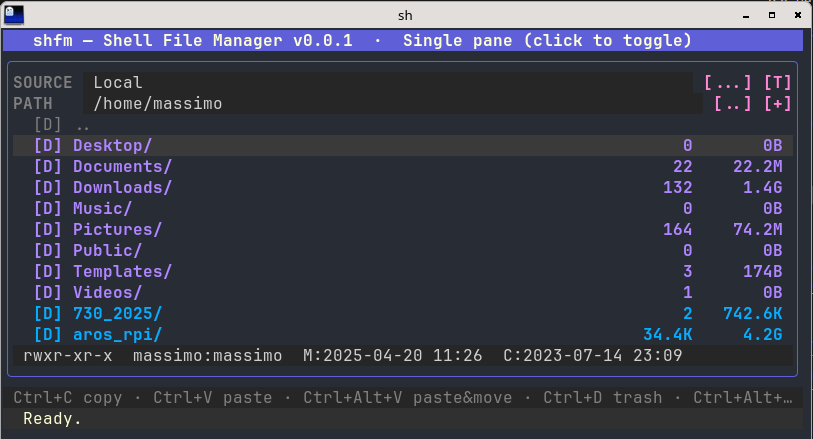

# shfm — Shell File Manager v0.5.9

shfm is a file manager for the terminal. It browses and manages files
on local disks, removable drives, phones and cameras (MTP), network
shares (SMB, NFS, SFTP) and cloud storage (Google Drive, Dropbox,
Microsoft OneDrive) from a single interface, driven by keyboard or mouse,
in one pane or two side by side.

Besides copying, moving and deleting in the background, it handles
archives, the trash, automatic mirrors and file associations, formats
removable drives, and searches by name or — fully locally — by content.
It keeps encrypted vaults in the standard age format, even split across
three sources, and opens files in other applications in place, network
ones included. It also works as the desktop's file manager and file
dialog. Cloud storage, semantic search and encrypted vaults are optional
modules, all included in the [release packages](#packages).

<!-- site:skip -->
Website: **<https://massimo82.github.io/shfm/>** — this README, page by
page. Downloads: [latest release](https://github.com/massimo82/shfm/releases/latest)
(see [Packages](#packages)).
<!-- /site:skip -->



## Features

- Single or dual pane, switched with `Ctrl+L`.
- Hidden files shown or hidden with `Ctrl+H` (or `.`).
- Optional [Nerd Font](https://www.nerdfonts.com/) icons, turned on or
  off with `Ctrl+Alt+N`.
- Keyboard shortcuts without function keys, full mouse support and
  drag&drop.
- Multi-selection.
- Copy, move, delete, rename, new file and new folder, even between
  different sources.
- Sources: local disks, removable USB/SD drives (mounted automatically),
  MTP devices, [remote sources](#remote-sources) (SMB, NFS, SFTP) and —
  as an optional module — [cloud storage](#cloud-storage) (Google Drive,
  Dropbox, Microsoft OneDrive).
- Background tasks with progress, and desktop notifications when they
  finish.
- Clipboard shared with the desktop (Wayland), both ways.
- Colored listing, a detail line with permissions, owner and dates, and
  folder sizes.
- Opening files with the desktop's default application, and a dialog to
  see and change which application opens each file type, by extension —
  shared with GNOME, KDE and the other desktops. Without a graphical
  session, text and configuration files open in nano (or vim) in shfm's
  own terminal.
- Open network sources listed in other applications' file dialogs, in
  GNOME/GTK and KDE.
- Desktop integration, optional: shfm registers as a file manager like
  any other — for opening folders, browsers' "Show in folder" and their
  file dialog (e.g. choosing the download folder) — used when the system
  picks it.
- Properties dialog, to view and edit permissions, owner and group.
- Automatic elevation (`pkexec`) for operations that need it, with the
  password asked inside shfm.
- Search by name: live filter, regex, recursive.
- Semantic search by content, optional and fully local.
- Freedesktop.org trash: move to trash, restore, empty.
- Archives: extract one into a new folder next to it, or create one
  choosing its format (ZIP, TAR with gzip/xz/zstd/bzip2/lzip/lz4, 7z).
- Automatic one-way mirrors (rsync or generic engine) that never touch
  the source.
- Formatting removable drives (exFAT, FAT32, ext4, XFS).
- Optional module: [encrypted vaults](#encrypted-vaults), folders on any
  source whose files and names are encrypted (standard age format).
- Desktop launcher entry installed on first run.

## Overview

shfm is written in pure Go, built on
[bubbletea v2](https://github.com/charmbracelet/bubbletea) (Elm architecture)
and [lipgloss v2](https://github.com/charmbracelet/lipgloss) for the UI.

It talks **directly to the hardware and to remote protocols** — removable
media (mounted via udisks2 D-Bus, no root needed), **MTP** devices
(smartphones/cameras over raw USB), **SMB**, **NFS** and **SFTP** — all in
Go, never shelling out to external commands for them (`mount`, `smbclient`,
`udisksctl`, `ssh`...). Every protocol but MTP is pure Go with no C
dependency; MTP uses [`github.com/hanwen/go-mtpfs`](https://github.com/hanwen/go-mtpfs)
for the PTP/MTP protocol itself, which requires cgo and `libusb-1.0` for
the underlying USB transport.

The only external programs shfm ever runs are: the desktop's default
application, when you open a file; `pkexec`, to elevate a permission-denied
operation (see [Notes](#notes)); for archives in formats the Go standard
library can't read or write (see [Archives](#archives)), `xz`, `zstd`,
`bzip2`, `lzip`, `lz4`, `bsdtar`, `7z` and `unrar` when they happen to be
installed; and, only for the optional semantic content search, `pandoc`
and `libreoffice`/`soffice`. None of them is assumed to be there. They are
looked up on `$PATH` first, then in the folders programs are usually
installed in (`/usr/local/bin`, `/usr/bin`, `/usr/sbin`..., NixOS's
`/run/current-system/sw/bin` and profiles, `/snap/bin`, Homebrew,
`~/.local/bin`, `~/bin`), because shfm started by D-Bus (as the portal's
file dialog) or by a desktop launcher may get a much shorter `$PATH` than
your shell's.

## Layout

Each pane shows, top to bottom: the **SOURCE** field (the active source —
local disk, removable device, MTP, remote source, cloud account or
encrypted vault) with a `[...]` button
to change it and a `[T]` button to toggle the trash view; the **PATH**
field (the current path, directly editable) with a `[..]` button to go up
one folder and a `[+]` button to create a new file or folder; the file
list (with a `.. ` entry at the top to go up, besides the button); a
per-pane **detail line** showing the permissions, owner, group and
modification/creation dates of whichever entry is currently under that
pane's cursor (a file, folder, or symlink), updating as the cursor moves;
and, shared below both panes even in **dual-pane** mode, a single summary
help line with the main shortcuts (scrolling round when the terminal is
too narrow for it). Click the title bar, or press Ctrl+L,
to toggle between single- and dual-pane layout.

## Features in detail

- **Single or dual pane**, toggled with `Ctrl+L` or a click on the title
  bar; shfm always starts in single-pane mode.
- **No function keys**: every shortcut uses `Ctrl` (and `Ctrl+Alt` for
  "alternative" variants), designed for modern keyboards where F1-F12 are
  often missing or hard to reach.
- **Full keyboard and mouse navigation**, including real **drag&drop**:
  drag one or more items (even a multi-selection) onto a folder — in the
  same pane or the other one — to move them; hold `Ctrl` while releasing
  to copy instead. Every interactive element (SOURCE/PATH fields, `[...]`/
  `[T]`/`[..]`/`[+]` buttons, menu entries) is clickable.
- **Multi-selection**: `Space` to toggle, `a`/`A` to select all/none,
  `Ctrl`+click for a single entry, `Shift`+click for a range.
- **Copy, paste (as a copy or moving), delete, rename, new file, new
  folder**, even across different sources (local ↔ SMB ↔ NFS ↔ SFTP ↔
  MTP), via streaming when no more efficient native operation is
  available.
- **Background tasks with progress**: copy/move/delete run as background
  tasks with a live progress dialog; closing it (`Esc`) just sends the
  task to the background — it keeps running. Copying, moving to another
  source and compressing show the bytes copied out of the total, the
  speed, the time left and the files copied out of how many: the total
  is measured while the copy already runs, and shows as `?` until then.
  For cloud storage, the bytes counted are those the service received.
  Cancelling (`c`) stops even halfway through a file, removing it.
  `Ctrl+B` opens the list of
  background tasks, to check on or reopen any of them. Quitting while
  tasks are still running shows a warning first.
- **Desktop notifications for backgrounded tasks**: a task sent to the
  background (`Esc`) that then finishes — successfully, with errors, or
  cancelled — while you're not watching its progress dialog posts a
  desktop notification, via the standard `org.freedesktop.Notifications`
  D-Bus interface (works with any DE/WM's notification daemon — mako,
  dunst, swaync, GNOME Shell, Plasma, xfce4-notifyd... — no external
  `notify-send` binary needed). A task still open in its progress dialog
  when it finishes doesn't also get a notification, since you're already
  looking at it. Set `"notifications": false` in
  `$XDG_CONFIG_HOME/shfm/config.json` to opt out entirely.
- **Clipboard shared with the desktop (Wayland)**, both ways: items
  copied with `Ctrl+C` can be pasted in other applications (a graphical
  file manager, an editor...) as file URIs — `file://` for local files,
  `smb://`, `sftp://`, `nfs://`, `mtp://` for the other sources — and
  files copied in another application are what `Ctrl+V` (copy) /
  `Ctrl+Alt+V` (move) paste in shfm, until something is copied in shfm
  again; the shfm key always decides between copy and move. Pasted
  network/MTP URIs are read from a pane that has that source open, else
  from a saved source (connected in the background just for the
  transfer). Implemented natively over the compositor's data-control
  protocol (`internal/wlclip`, no `wl-copy`/`wl-paste` needed): works on
  wlroots compositors (labwc, sway, Hyprland...) and KDE Plasma; elsewhere
  it quietly stays off. What shfm copies stays on the clipboard while shfm
  runs. On by default; `Ctrl+Alt+C` turns it off (and on again),
  remembered as `"share_clipboard"` in `$XDG_CONFIG_HOME/shfm/config.json`:
  off, the clipboard stays private.
- **Colored listing** by file type (folders, symlinks, executables,
  archives, images, media) and by permissions (read-only entries are
  shown in a fainter shade).
- **Nerd Font icons** (off by default): monochrome
  [Nerd Font](https://www.nerdfonts.com/) icons, in the color of the
  entry's name, replace the bracketed `[D]`/`[F]`/`[L]` ones: folders,
  the standard user folders (Desktop, Documents, Downloads, Music,
  Pictures, Videos, Templates, Public) each with its own, links to a
  folder and to a file, trash folders (the trash view's source too), and
  files by type (documents, images, audio, video, archives, packages,
  some 40 programming and markup languages, data and configuration
  files, and files known by name such as `Makefile`, `Dockerfile` or
  `.gitignore`);
  a file of any other type gets the generic file icon. `Ctrl+Alt+N`
  turns them on or off, remembered as `nerd_icons` in `config.json`.
  Before turning them on, shfm checks that a Nerd Font is installed (a
  font file in the font folders, or a family `fc-list` reports) and
  warns that the icons may cause some layout problems: the terminal
  must use a Nerd Font, and depending on the terminal and the font an
  icon can spill over into the next cell. With no Nerd Font found the
  icons stay off; `"nerd_icons": true` set by hand isn't checked, for a
  terminal whose fonts are on another machine (SSH).
- **Per-pane detail line**: permissions (`rwx` for user/group/others,
  followed by `[immutable]` / `[append-only]` when the entry carries such a
  `chattr` flag), owner, group, and modification/creation dates for whichever entry is
  under that pane's cursor, always shown just above the shared help line —
  independent per pane, so each side can inspect a different entry at
  once. Creation date is populated (on local files only, via a single
  cheap `statx(2)` call per cursor move, never a directory walk) when the
  filesystem records one — not every one does (e.g. tmpfs), in which case
  it's shown as `-`.
- **Folder sizes and item counts**: on the local filesystem, folders show
  their total recursive content size and item count (files and subfolders
  combined), just like files show their size, computed **in the
  background** (a goroutine per folder) so opening a directory is never
  blocked by it — each folder shows `?`/`?B` until ready, then updates in
  place.
- **Open with the default application**: `Enter`/double-click on a file
  opens it with the desktop's configured default app (via the XDG MIME
  Applications spec); if none is set, a chooser lists the installed
  applications — those declaring the file's type first — and remembers the
  pick for next time. Files on SMB, NFS,
  SFTP and MTP sources are opened **in place**, through a FUSE mount shfm
  makes of the source (see Notes): a video player starts
  streaming a film on a share or a phone at once, seeking included, and an
  editor saves straight back to the source — as when opening files from
  gvfs's mount in other file managers, with no password asked again. Where
  FUSE isn't available, files are opened from a downloaded temp copy
  instead, uploaded back if the app changed it.
- **Text files without a graphical session**: when neither
  `WAYLAND_DISPLAY` nor `DISPLAY` is set (the console, SSH without X
  forwarding), no desktop application could open a window, so text files
  — `text/*` and every type declared a `text/plain` subtype: configuration
  files, shell scripts, JSON, YAML, TOML, XML..., files with no extension
  whose content is text, and empty files — open in a terminal editor
  instead: `nano` if installed, otherwise `vim`, otherwise `vi`. It takes
  over shfm's terminal until it exits, then shfm comes back; files on
  network sources and phones are edited through the FUSE mount, or a temp
  copy uploaded back if changed. Other files, or text files with none of
  those editors installed, open as usual.
- **File associations** (`o`): see and change which application opens
  each file type, listed by extension, shared with GNOME, KDE and the
  other desktops; a file with no extension is recognized by its content.
  See [File associations](#file-associations).
- **Properties dialog** (`i`): view type, size, modification date,
  permissions, owner and group (plus any `immutable`/`append-only` `chattr`
  flag, on the local filesystem); on backends that support it (local
  filesystem, SFTP, NFS), edit permissions (octal), owner and group
  directly.
- **Automatic elevation for permission-denied operations** (Linux only):
  chmod/chown (Properties dialog), delete and move/rename on the *local*
  filesystem go straight to `pkexec` when shfm can already tell, from the
  standard Unix owner/group/other permission model, that the plain attempt
  would fail — e.g. editing, deleting or moving something owned by root —
  and fall back to it reactively (as before) if a permission error still
  turns up unexpectedly. The password is asked in a dialog of shfm's own:
  shfm is its own PolicyKit authentication agent (for its own process
  only), so no graphical agent is needed and pkexec's text prompt never
  draws over the TUI; it only appears when actually needed. Should the
  agent fail to register (no system bus), pkexec gets the terminal to
  itself for its text prompt. See [Notes](#notes) for exactly how this
  is scoped.
- **Search/filter by name** (`/`): live substring match (case-insensitive)
  in the current folder as you type; `Tab` switches to full regex
  matching, `Ctrl+R` switches from filtering the current folder to a
  background recursive search of the whole subtree (applied on `Enter`,
  not live, to avoid re-walking a large or remote tree on every
  keystroke).
- **Semantic (content) search** (`Ctrl+F`, optional): finds files by what
  they *say*, not by their name, using a local Qwen3 embedding model (and,
  optionally, a reranker) — no network, nothing leaves the machine. Not part
  of the base build: see [Optional: semantic (content) search](#optional-semantic-content-search).
- **Trash compliant with the Freedesktop.org Trash Specification 1.0**:
  "home" trash (`$XDG_DATA_HOME/Trash`) and "top directory" trash cans for
  external devices, restore (`R`), empty (`e` in the trash view, opened
  with `T`).
- **Source picker** (`Ctrl+S`, or a click on the SOURCE field/`[...]`
  button): lists, live, local disks (the one holding the home folder
  opens there, the others at their root), **removable USB/SD devices** (even
  unmounted ones — mounted automatically, preferring the system's
  **udisks2** D-Bus service, the same mechanism GNOME/Nautilus/Thunar
  use, so a regular local user can mount/unmount without root; falls back
  to a direct `mount(2)` syscall if udisks2 is unavailable), **MTP
  devices** (detected and driven over USB via `github.com/hanwen/go-mtpfs`,
  see [Notes](#notes)), the saved [remote sources](#remote-sources) (SMB,
  NFS, SFTP) and, with the optional modules, the
  [cloud accounts](#cloud-storage) and the **Vaults** section (split
  vaults, locking: see [Encrypted vaults](#encrypted-vaults)), each group
  under its own title. Opening an MTP device or a network
  source always happens **in the background**: a "Connecting…"
  placeholder appears immediately and the rest of shfm stays fully
  responsive no matter how long the USB/network I/O takes (a slow or
  unresponsive device can never freeze the UI); dismissing it (Esc) just
  stops watching — the attempt keeps running and is applied whenever it
  completes, wherever the pane that requested it ends up being.
- **Automatic one-way mirrors**: copy a file or folder (`Ctrl+C`), then
  paste it as a mirror with `Ctrl+Alt+M` — after a confirmation dialog
  showing source → destination, the destination is kept **identical** to
  the source (recursively, deletions included): synced right away, then
  every 5 minutes while shfm runs and both ends are available. A local
  disk or removable drive counts as available while mounted (recognized by
  its filesystem UUID, wherever it gets mounted), a network or MTP source
  while a pane has it open. Between local sources you can choose the
  **rsync delta-transfer** algorithm (only changed blocks are written;
  runs in-process via a patched copy of
  [`gokrazy/rsync`](third_party/gokrazy-rsync), no `rsync` binary needed)
  or a generic whole-file copy; any other combination uses the generic
  one. `Ctrl+Alt+M` with an empty clipboard lists the saved mirrors (sync
  now, pause/resume, delete). The source is never modified: see
  [Automatic mirrors](#automatic-mirrors) for how that's enforced.
- **Archives**: `x` extracts the selected archives (or the one under the
  cursor), each into a new folder in the same directory named after the
  archive minus its extension; `z` creates an archive of the selected
  entries, choosing its format and name. See [Archives](#archives).
- **Format a removable source**: pick exFAT, FAT32, ext4 or XFS, via a
  dedicated dialog with a red data-loss warning followed by a second,
  explicit "type YES to proceed" confirmation. Refuses to format the disk
  the system itself is running from, as a hard safety rail on top of the
  UI confirmations. Implemented over udisks2 D-Bus (`Block.Format` /
  `PartitionTable.CreatePartition`), the same mechanism GNOME Disks uses.
- **Desktop launcher entry**: on first run, shfm installs a `shfm.desktop`
  file so it shows up in your desktop environment's application menu —
  system-wide (`/usr/share/applications`) if run as root, per-user
  (`~/.local/share/applications`) otherwise — but only if neither already
  exists.

## File associations

Which application opens a file (`Enter` or a double click on it) depends
on the file's type: `o` opens the list of every type, by extension, with
the application opening it, to see it and change it. shfm keeps no
associations of its own: it reads and writes the same files as GNOME, KDE
and the other Linux desktops, so a choice made in shfm holds in them too,
and theirs in shfm.

### The associations dialog

```
Showing all file types (Tab switches).

Filter:

  .md                text/markdown                  Kate  · system
▸ .pdf               application/pdf                Okular
  .png               image/png                      Gwenview  · system
```

Each row is a file type: its extensions, its MIME type and the application
opening it. `· system` (dimmed) marks the system's choice; the others are
yours. The cursor starts on the type of the file under the cursor in the
list.

| Key | Action |
|---|---|
| typing | filter by extension (`pdf`, `.mkv`), MIME type or application name |
| `↑` `↓`, `PgUp` `PgDown`, `Home` `End` | move |
| `Tab` | switch between every type and only those you chose an application for |
| `Enter` / click | choose the type's application (see below) |
| `Del` / `Ctrl+R` | reset the type to the system's choice, dropping yours |
| `Esc` | close |

Typing an extension no application is associated with yet (`.xcf`, say)
shows a row for its type, to choose one. `j`/`k` type in the filter here,
like any letter: move with the arrows (or `Ctrl+J`/`Ctrl+K`).

### Choosing an application

The same chooser opens from the associations dialog and when opening a
file whose type has no application yet. It lists the applications
installed right now, read afresh each time, so one just installed is
there: those declaring the type first, the others dimmed (they may still
open it, but don't say so). `✓ current` marks the type's application.

| Key | Action |
|---|---|
| typing | filter by application name |
| `↑` `↓`, `PgUp` `PgDown`, `Home` `End` | move |
| `Enter` / click | make it the type's application — and open the file with it, when opening one |
| `Esc` | back to the associations dialog, or cancel opening the file |

### How a file's type is told

By its name first, from the system's MIME database (shared-mime-info):
extensions and other name patterns, with their weights, case-sensitive
ones (`main.C` is C++, `main.c` C), aliases, and literal names
(`Makefile`). When the name doesn't tell — no extension, or an unknown
one — by its content: the database's "magic" rules, reading only the
file's first bytes (as many as the rules look at: under 20 KB with the
usual database), then plain text or binary, as
GNOME tells them. An empty file is `application/x-zerosize`. On network
sources and phones, that read happens in the background, so shfm never
waits on it.

A type with no application of its own opens with its parent type's: a C
source file, `text/x-csrc`, with the text editor (`text/plain`).

### The standards it follows

- **Shared MIME-info** (freedesktop.org): the MIME database in each
  `$XDG_DATA_DIRS/mime` (`globs2`, `magic`, `aliases`, `subclasses`),
  the user's own (`~/.local/share/mime`) first.
- **Desktop Entry**: the applications are the `.desktop` files in every
  `applications` folder of `$XDG_DATA_HOME` and `$XDG_DATA_DIRS`,
  subfolders included, shown by their name in your language. `Hidden`
  (an application the user removed), `TryExec` (a program not
  installed), `NoDisplay`, `OnlyShowIn`/`NotShowIn` are honored; a
  `Terminal=true` application runs in [the terminal](#the-terminal); the
  `Exec` line's quoting and field codes are expanded as the spec says.
- **MIME Applications Associations**: the `mimeapps.list` files in
  `$XDG_CONFIG_HOME`, `$XDG_CONFIG_DIRS` and the `applications` folders,
  with each the current desktop's own first (`gnome-mimeapps.list`,
  `kde-mimeapps.list`, from `$XDG_CURRENT_DESKTOP`). A type's application
  is the first installed one of its `[Default Applications]`; failing
  that, of its `[Added Associations]` less `[Removed Associations]`, then
  of the applications declaring the type.

Choosing an application writes it as GNOME and KDE do, to
`~/.config/mimeapps.list` (`$XDG_CONFIG_HOME`): the type's
`[Default Applications]` entry, the application first in its
`[Added Associations]` and out of its `[Removed Associations]`; a default
for the type in your desktop's own list (`kde-mimeapps.list`, say), which
would win over it, is dropped. Resetting drops the type from all three
sections of your lists. Everything else in the files stays as it was, and
they're replaced atomically.

## Archives

**Extracting** (`x`): every selected archive (or the one under the
cursor; selected entries that aren't archives are left alone) is
extracted, as a background task, into a **new folder in the same
directory**, named after the archive minus its extension:
`photos.tar.gz` → `photos/`, `report.txt.gz` → `report.txt/report.txt`.
If that name is taken, `photos (2)`, `photos (3)`... are used instead:
nothing existing is ever overwritten. It works on every source (local,
removable, SMB, NFS, SFTP, MTP), reading and writing through the source
itself.

Nothing is ever written outside the new folder: entries named with
`../` or pointing out through a symbolic link are skipped, as are
encrypted entries, device files and FIFOs; symbolic links are created
only on local sources (the other backends have none), and hard links
become copies. Whatever was skipped is reported as the task's error,
without stopping the rest. Cancelling (`c` in the progress dialog)
removes the partial folder.

**Creating** (`z`): a dialog lists the formats this machine can write
(`↑`/`↓`, `Tab` or a click picks one, and swaps the name's extension)
above the archive's name, proposed from the entry's name (or the folder's,
for several entries). The archive is created in the current folder, never
over an existing file. Its content always sits in **one root folder
named like the archive minus its extension**: `bundle.tar.zst` holds
`bundle/<the selected entries>`, so extracting it anywhere never
scatters files. Symbolic links are stored as links from a local source,
and followed to files elsewhere. The last format chosen is proposed
first next time.

| Format | Extract | Create |
|---|---|---|
| `.zip`, `.tar`, `.tar.gz`/`.tgz`, `.gz` | built in | built in (not `.gz`) |
| `.tar.bz2`/`.tbz2`/`.tbz`, `.bz2` | built in | `bzip2` or `bsdtar` (not `.bz2`) |
| `.tar.xz`/`.txz`, `.xz`, `.tar.lzma`/`.tlz`, `.lzma` | `xz`, or `bsdtar` for the tar ones | `.tar.xz`: `xz` or `bsdtar` |
| `.tar.zst`/`.tzst`, `.zst` | `zstd`, or `bsdtar` for the tar one | `.tar.zst`: `zstd` or `bsdtar` |
| `.tar.lz`, `.lz` | `lzip`/`plzip`, or `bsdtar` for the tar one | `.tar.lz`: `lzip`/`plzip` or `bsdtar` |
| `.tar.lz4`, `.lz4` | `lz4`, or `bsdtar` for the tar one | `.tar.lz4`: `lz4` or `bsdtar` |
| `.7z` | `bsdtar` or 7-Zip (`7z`/`7zz`/`7za`) | `bsdtar` or 7-Zip |
| `.rar` | `bsdtar`, `unrar` or 7-Zip | — |

Not created: RAR (its compressor is proprietary), `.tar.lzma` (superseded
by xz) and single compressed files such as `.gz` (an archive does the same
job). Which formats are available depends on the tools installed: the
create dialog lists every format, showing the ones this machine can't
write dimmed with what to install (`.tar.lz — lzip · needs lzip or
bsdtar`), and extracting an archive whose tool is missing is refused
straight away, saying what to install. External tools run without a terminal, so one asking for an
encrypted archive's password fails instead of taking over shfm's screen.
The same code (`internal/archive`) reads the archives indexed by the
semantic search.

## Automatic mirrors

A mirror makes its **destination** identical to its **source**, one way:
files are copied from the source to the destination, and files that are
no longer in the source are deleted from the destination. Nothing is ever
written to or deleted from the source. The rules below exist to keep it
that way, including when a destination turns out to be the source under
another name.

### Creating a mirror

`Ctrl+C` a file or folder, go to the folder that should hold the copy and
press `Ctrl+Alt+M`. Each copied item `name` gets a pair
*source/name → destination folder/name*. Before anything is saved:

1. A path check refuses a destination that is the source, is inside it or
   contains it, and a destination that already belongs to another mirror.
2. A **data check** (see [Protecting the source](#protecting-the-source))
   makes sure the destination isn't the source's own data reached another
   way. If it is, an error is shown and **no mirror is activated**. When it
   can't be verified in time, the confirmation shows a `WARNING: could not
   verify…` line and the choice is yours.
3. The confirmation dialog lists every pair, noting destinations that
   already exist (they'll be made identical to the source, so their extra
   files are deleted), and, between local folders, offers the rsync or the
   generic engine.

### Pausing and deleting

The list of mirrors (`Ctrl+Alt+M` with an empty clipboard) shows each
pair's status, including the last error of a failed sync.

- **`p` pause/resume**: a paused pair isn't synced. Pausing also **stops a
  sync already in progress** instead of letting it finish.
- **`x` delete**: stops a sync in progress too, then removes the pair and
  its state file. What happens to the files already copied depends on the
  destination:
  - **nothing has been copied yet**: a plain yes/no confirmation;
  - **it holds a copy**: the dialog shows where the copy is and asks what
    to do with it: **Keep the copied files** (preselected, so a reflex
    Enter never deletes anything) or **Move the copy to the trash**
    (**Delete the copy permanently** on SMB/NFS/SFTP/MTP, which have no
    trash). If the sync was still running, the copy is deleted only once
    it has actually stopped, so it can't be recreated behind the deletion;
  - **the destination or the source isn't available** (disk unmounted,
    connection closed): the copy can't be checked, so it's **kept**, and
    the dialog says so.

  Only the destination's copy is ever deleted, and only after the data
  check has confirmed it isn't the source; if the check finds an overlap,
  or can't rule one out, the deletion is refused with an error.

### Protecting the source

Comparing paths isn't enough: the same files can be reached through a
symlink, a bind mount, a network share of a local folder, or two
different connections to the same server. So before creating a mirror,
before **every** sync, and before deleting a copy, shfm checks whether
the destination is the source, is inside it, or contains it **as actual
data**, with one of two strategies depending on where the two sides are.
Folders that merely hold a copy of the same content are *not* the same
data: mirroring between them is allowed.

**1. Both sides local: device and inode.** Every file on a local
filesystem is identified by its device and inode number, whatever path
leads to it. shfm stats the source and walks up from the destination
(and vice versa), comparing device and inode at each level: finding the
source among the destination's ancestors means the destination is inside
it, and the other way round means it contains it. A copied folder has
new inodes, so it never matches. This check is instant, writes nothing,
and always gives a definite answer.

**2. At least one network side (SMB, NFS, SFTP, MTP): a probe file.**
Inodes can't be compared across backends, so shfm creates a hidden,
empty file `.shfm-mirror-probe-<random>` in the destination's folder and
looks for it from the source side, then removes it:

- first in the source and each of its ancestors: found there, it tells
  exactly where the destination's folder sits relative to the source, so
  a destination that is the source, contains it, or is inside it is
  recognized, while one merely next to it is not;
- otherwise, by listing the source's subfolders: finding it there means
  the destination is somewhere inside the source.

Listing a large source over the network takes time, so this search is
capped at **10 seconds** (and 20,000 folders). When creating a mirror it
runs **in the background** behind a "Checking…" dialog: shfm stays
usable, and `Esc` stops it without activating anything. If the cap is
reached, the result is "can't verify": creating the mirror asks you with
a warning, a sync goes ahead (you accepted the pair), and a copy deletion
is refused. The probe file is written only in the destination's folder;
it can end up inside the source only in the very case being detected,
and it's removed right away.

Where the check applies:

| When | Overlap found | Can't verify |
|---|---|---|
| Creating a mirror | error, nothing activated | warning in the confirmation |
| Every sync | the sync fails, nothing touched | the sync runs |
| Deleting the copy | deletion refused | deletion refused |

On top of that, a sync never deletes anything when the source can't be
read: a missing or unreadable source root fails the run, and an
unreadable subfolder's counterpart is left alone (see [Notes](#notes)).

## Remote sources

**SMB** (Windows and Samba shares), **NFS** exports and **SFTP** servers,
in every build: shfm talks to them directly, in Go — no `mount`,
`smbclient` or `ssh` involved, nor root. They're listed in the **Remote**
section of the source picker (`Ctrl+S`).

### Connecting

Choose **New SMB connection…**, **New NFS mount…** or **New SFTP
connection…** in the source picker, and fill in the form:

- **SMB**: host, share, domain, user and password (no user: as a guest);
- **NFS**: host and export path, with the UID and GID the server sees;
- **SFTP**: host, port, user, password and the folder to start in.

Once connected, the source opens in the pane and is **saved** in the
Remote section, to open again with a click. SMB and SFTP passwords, if
entered, are saved **encrypted at rest** (AES-256-GCM, with a key derived
from the machine and the user — see `internal/secret` in
[Notes](#notes)), never in plain text. A saved source is removed, its
password with it, with `x` (or `Delete`) on it in the source picker — once
no pane on screen is open on it (the pane single-pane mode hides counts as
closed: it goes back to the home folder).

### What to expect

- **SFTP** host keys are verified and recorded in `~/.ssh/known_hosts`,
  trust on first use, as OpenSSH does.
- **NFS** exports that only accept privileged source ports need a
  capability on the shfm binary (see [Building](#building) and
  [Notes](#notes)).
- A connection that drops (a server or a router closing it after hours
  of inactivity) is reopened by itself on the next operation.
- Remote sources can be browsed from other applications' file dialogs
  while shfm has them open, and their files open in other applications in
  place: see
  [Network sources in other applications](#network-sources-in-other-applications).

## Network sources in other applications

While shfm has a [remote source](#remote-sources) (SMB, NFS, SFTP) or,
with the optional module, a [cloud account](#cloud-storage) open, other
applications can browse it too, from their own file dialogs — to attach a file on the NAS
in a mail client, for instance — as they can with a share opened in
Nautilus, Thunar or Dolphin. shfm mounts the source as soon as it's
opened (see the FUSE mounts in [Notes](#notes)), and the mount stays until
shfm exits, or until it's ejected from a file dialog. It's named after the
source, e.g. `video on nas` for `smb://nas/video`. No daemon is involved,
and nothing in shfm depends on it: if the mount fails, shfm works as
before.

- **KDE** (Dolphin's and KDE applications' file dialogs, and GTK
  applications' under Plasma, through the file chooser portal): works
  out of the box. The source is listed under **Remote**.
- **GNOME and other GTK/GIO desktops**, standalone compositors (Hyprland,
  sway, labwc...) included (GTK applications' file dialogs, the file
  chooser portal's included): needs a small optional GIO module,
  which lists the source under **Other Locations → Networks**:

  ```sh
  make -C contrib/gio-module
  sudo make -C contrib/gio-module install     # uninstall: sudo make -C contrib/gio-module uninstall
  ```

  It only needs GLib's development files (`glib2` on Arch, `libglib2.0-dev`
  on Debian/Ubuntu) and works with or without gvfs. Applications started
  before it was installed see it once restarted — and so does the file
  chooser portal, which many applications (Thunderbird and Firefox
  included) show their file dialog through, and which runs for the whole
  session: `systemctl --user restart xdg-desktop-portal-gtk`, or log out
  and back in.

Applications get plain local paths (the mount lives under
`$XDG_RUNTIME_DIR/shfm/`), so what they open or save goes through shfm's
connection. Qt applications that don't use KDE's file dialogs don't list
the source, as they don't list gvfs's or KDE's either. MTP devices aren't
listed this way: desktops list phones themselves.

## Cloud storage

**An optional module**, not part of the base build: cloud storage exists
only in a shfm built with the `cloud` tag (see
[Building with cloud storage](#building-with-cloud-storage)) — as the
release packages and archives are, with every feature (see
[Packages](#packages)).

shfm opens **Google Drive**, **Dropbox** and **Microsoft OneDrive**
accounts as sources: browsed, copied to and from, mirrored and opened in other
applications like any other source. They're listed in their own **Cloud**
section of the source picker (`Ctrl+S`), below the local and remote ones;
without the tag, there's no trace of them.

To add an account, choose **New Google Drive account…** (or Dropbox, or
Microsoft OneDrive): shfm asks for the OAuth client to authorize it with
(see below), then opens the service's authorization page in the browser.
Once you allow shfm access there, the browser comes back to shfm, which
opens the account in the pane and saves it in the Cloud section. Over SSH,
or without a graphical session, shfm shows the page's address instead:
open it in a browser anywhere, and paste back the address the browser
ends up on (it fails to load, since it points at the machine shfm runs
on: that's expected) — or, for Dropbox, the code it shows.

shfm never sees your password: it gets an OAuth token, kept encrypted in
`~/.config/shfm/cloud-tokens.json` (see `internal/secret` in
[Notes](#notes)). When an account's authorization is revoked or expires,
choosing it opens the form to authorize it again. To remove an account,
press `x` (or `Delete`) on it in the source picker, once no pane on screen
is open on it: shfm deletes its token and forgets it. The authorization itself stays valid with the service
until you revoke it there, in the account's security settings (Google:
"Third-party apps & services"; Dropbox: "Connected apps"; Microsoft:
"Apps and services").

### Building with cloud storage

The module is pure Go, its dependencies vendored like the others:

```sh
go build -tags cloud -o shfm .
```

A build can carry OAuth clients registered for it (see [Registering shfm
with the services](#registering-shfm-with-the-services)), so its users
don't have to register their own; each is optional:

```sh
go build -tags cloud -o shfm -ldflags "\
  -X shfm/internal/cloud.googleClientID=... -X shfm/internal/cloud.googleClientSecret=... \
  -X shfm/internal/cloud.dropboxAppKey=... \
  -X shfm/internal/cloud.oneDriveClientID=..." .
```

Tags combine with the others, e.g. `-tags "cloud vault"`, or
`-tags "semantic vulkan cloud vault"` for the
[full build](#full-build-every-feature-vulkan-gpu-acceleration).

### Registering shfm with the services

Each service wants applications to identify themselves with an OAuth
client. A build can carry its own (see [Building](#building)); otherwise
register one yourself, free, and enter it when adding the account:

- **Google Drive**: in the [Google Cloud console](https://console.cloud.google.com/),
  create a project, enable the **Google Drive API**, then set up the
  **OAuth consent screen** (External, with the scope
  `https://www.googleapis.com/auth/drive`) and **publish it to
  production** — while it's in testing, Google expires its authorizations
  after 7 days. A personal client needs no verification by Google: its
  authorization page just warns that the application isn't verified.
  Then, under **Credentials**, create an **OAuth client ID** of type
  **Desktop app**: enter its client ID and its client secret (Google
  requires both).
- **Dropbox**: in the [App Console](https://www.dropbox.com/developers/apps),
  create an app with **Scoped access** and **Full Dropbox**; under
  **Permissions** tick `files.metadata.read`, `files.metadata.write`,
  `files.content.read`, `files.content.write` and `account_info.read`;
  under **OAuth 2 → Redirect URIs** add `http://localhost:53682/` (the
  same as rclone's, so an app registered for rclone works too). Enter its
  **App key** as the client ID; the secret isn't needed.
- **Microsoft OneDrive**: in the [Microsoft Entra admin center](https://entra.microsoft.com/),
  under **App registrations**, register an application for **Accounts in
  any organizational directory and personal Microsoft accounts**, with a
  **Mobile and desktop applications** redirect URI `http://localhost`, and
  **Allow public client flows** turned on; under **API permissions** add
  Microsoft Graph's delegated `Files.ReadWrite.All`, `User.Read` and
  `offline_access`. Enter its **Application (client) ID**; no secret.

### What to expect

- **Google Drive** isn't a filesystem: a folder can hold several files
  with the same name (the most recently modified one is the one shfm
  opens), and a name may contain `/`, shown as the look-alike `／`.
  Google's own documents are listed with the extension of the format
  they're read as — Docs `.odt`, Sheets `.ods`, Slides `.odp`, Drawings
  `.svg`, Apps Script `.json` — read-only, with no size until read; Forms,
  Sites, My Maps and the other Google types can't be exported at all,
  and aren't listed. Shortcuts are shown as links to their target.
  The account opens in **My Drive**; its root, one level up, also holds
  **Shared drives** (a folder for each shared drive the account is a
  member of) and **Shared with me** (what others shared with it).
- **Microsoft OneDrive**: the account opens in **My files**. A shared
  folder added to My files from OneDrive's website ("Add shortcut to My
  files") is a link there, which opens the shared folder — on any
  account. Work and school accounts also have **Shared**, one level up:
  what others shared from their OneDrive, found through Microsoft Search.
  Personal accounts don't: Microsoft has deprecated the API listing the
  items shared with an account (Graph's `sharedWithMe`, already degraded,
  then retired) with no replacement for them, so add the shared folders
  you use to My files. Moving between your files and a shared folder
  copies and deletes, as Graph doesn't move between drives. OneNote
  notebooks are listed as folders.
- The places at the root (My Drive, Shared drives, Shared with me, My
  files, Shared), the shared drives and the items shared with you can't
  be renamed, moved or removed from shfm — that would act on other
  people's files — but what's inside them can, as far as the account is
  allowed to. Removing a link in My files removes the link, not the
  shared folder.
- **Dropbox** keeps a file's modification time only as given when it's
  uploaded: it can't be changed afterwards.
- Deleting moves items to the service's own trash (recycle bin, deleted
  files), from which they can be restored on the service's website.
- Applications opening a cloud file in place (through the FUSE mount, see
  [Network sources in other applications](#network-sources-in-other-applications))
  read it straight from the service, but their changes are saved to it
  when they close the file: no service can change part of a file in
  place.
- Each operation is one or more requests to the service, so browsing is
  slower than on a local network; shfm retries the requests a service
  throttles, waiting as long as it asks.

## Encrypted vaults

**An optional module**, not part of the base build: encrypted vaults
exist only in a shfm built with the `vault` tag (see
[Building with vaults](#building-with-vaults)) — as the release packages
and archives are, with every feature (see [Packages](#packages)). Without it, the
**New encrypted vault** choice isn't offered, and a vault's folder opens
as a plain folder of encrypted files, saying so.

A vault is a folder, on any source — a local disk, a USB drive, SMB, NFS,
SFTP, an MTP device or a cloud account — holding only encrypted files,
which shfm shows in clear once it's unlocked with its password. Every
file in it is a standard [age](https://age-encryption.org) file, so a
vault can always be recovered without shfm (see
[Recovering a vault without shfm](#recovering-a-vault-without-shfm)).

### Building with vaults

The module is pure Go, its library ([age](https://github.com/FiloSottile/age))
vendored like the other dependencies:

```sh
go build -tags vault -o shfm .
```

Tags combine with the others, e.g. `go build -tags "cloud vault" -o shfm .`,
or `-tags "semantic vulkan cloud vault"` for the
[full build](#full-build-every-feature-vulkan-gpu-acceleration).

### Creating a vault

Choose **New encrypted vault** in the **New…** menu (the `[+]` button next
to the path), or **New encrypted vault…** in the **Vaults** section of the
source picker (`Ctrl+S`). By default the vault is created in the pane's
current folder — `Ctrl+T` in the form switches to a
[split vault](#split-vaults), and back. A vault can't be created inside
another (from inside one, only a split vault, which takes its place in
the pane; see also [Using a vault](#using-a-vault)). shfm asks for:

- the **name** of the vault's folder, created in the current folder;
- a **password**, at least 8 characters, with a rough strength indicator;
- whether **file names** are encrypted (the default, `Ctrl+N` to switch)
  or visible;
- whether the key is **post-quantum** (`Ctrl+K`, off by default).

shfm then shows the vault's **recovery key** once: it opens the vault
without the password, and decrypts its files with the age tools. Keep it
somewhere safe, away from the vault (on paper, in a password manager): if
both the password and the recovery key are lost, nobody can recover the
files.

### Using a vault

Entering a vault's folder (`Enter`, or a double click) asks for its
password — `Ctrl+R` switches to the recovery key. The pane then shows the
vault's content in clear, its SOURCE marked `[VLT]`: copy, move, rename,
delete and open files as anywhere else; `..` at the vault's root goes
back to the folder holding it.

- **Copying or moving out of a vault decrypts** the files: shfm says so
  in the status line. Copying into a vault encrypts them.
- **No vault inside a vault**: one can't be created there, nor copied,
  moved or mirrored into one — not even inside a folder, nor by another
  application through FUSE, nor extracted from an archive.
- **Deleting is final**: a vault's files never go to the trash.
- **Opening a file with an application** goes through the vault's FUSE
  mount (see [Network sources in other applications](#network-sources-in-other-applications)),
  read and write: an edited file is saved encrypted when the application
  closes it, its working copy kept in memory (`$XDG_RUNTIME_DIR`), never
  on a disk. Without FUSE, shfm decrypts a temporary copy there instead;
  without `$XDG_RUNTIME_DIR`, it doesn't open the file at all.
- **Not available inside a vault**: semantic search (it doesn't index
  vaults), and the file dialog mode (see
  [shfm as a file dialog](#shfm-as-a-file-dialog)), which shows a vault's
  encrypted files only.

The **Vaults** section of the source picker (`Ctrl+S`), from inside a
vault, changes its **password** — instantly, as only the vault's key file
is re-encrypted, and the old password stops working at once — and shows
its **recovery key** again, after asking for the password.

### Split vaults

A **split vault** is stored on three folders of three sources at once —
for instance three cloud accounts, or a NAS, a USB drive and a cloud
account: every file is split into three shards, one per folder, so that
**no source holds a whole file** (not even its encrypted form), and
**any two folders are enough** to read the vault. One source may be lost,
closed or unreachable without losing anything.

Open the new vault form (see [Creating a vault](#creating-a-vault)) and
press `Ctrl+T` to split it: a name, then for each of the three parts its
source (`Ctrl+←`/`Ctrl+→`: the local disk, a saved remote source, a cloud
account) and its folder — created if missing, otherwise it must be
empty — and the password, as for a vault in a folder. Three folders that
already hold a split vault add it back instead, with its password only
(after it was forgotten, or on another machine).
The vault is saved in the same section; choosing it connects to its three
sources and shows it in the pane, in place of the source the pane had.

- With a source unreachable, the vault opens **read-only** (shfm says
  which part is missing): reading needs two parts, any change all three.
- **Repair the parts of…**, in the same section while the vault is open,
  makes the three parts whole again once they're all reachable: it
  rebuilds the shards a part lacks — after it was unreachable, or replaced
  by an empty folder — and removes the leftovers of interrupted writes.
- Every write gives the file's three shards a new generation in their
  names (`<name>.<gen>.a`, `.b`, `.c0`/`.c1`): a write interrupted
  half-way never mixes two versions of a file.
- Space: one and a half times the vault's size in all (half on each
  part).
- The pane's source changes for the vault: locking it takes the pane back
  to the home folder. Forgetting a split vault (`x` in the source picker)
  leaves its files on the parts: the same form adds it back.

### Locking

A vault stays unlocked for the session — entering it again asks nothing —
until it's locked:

- from the **Vaults** section of the source picker, one vault at a time;
- with `Ctrl+Alt+L`, every vault (rebindable as `lock-vaults`, see
  [Customizing keybindings](#customizing-keybindings));
- on its own, after `vault_auto_lock_minutes` minutes without a key press
  or a click in shfm (in `config.json`: 15 by default, `0` never) — not
  while a copy or move is still running;
- by quitting shfm.

Locking takes the panes showing the vault back to the folder holding it,
unmounts it for other applications, and empties shfm's clipboard of its
entries.

### Security

- **Encryption**: each file has its own random key and is encrypted with
  ChaCha20-Poly1305, in authenticated 64 KiB chunks — damaged, truncated
  or tampered content is reported, never read as wrong data. The file
  keys are encrypted to the vault's X25519 identity, itself protected by
  the password with scrypt (about a second, once per unlock).
- **Post-quantum**: a hybrid ML-KEM-768 + X25519 identity instead, safe
  against future quantum computers.
- **Names**: when encrypted, files and folders are stored under random
  names, and each folder's names, sizes and dates are kept in its own
  encrypted index (`.index.age`, with the previous version as
  `.index.age.bak`). When visible, files are stored as `name.ext.age` in
  plain folders — easier to recover, but anyone with access to the source
  reads the names and the folder structure.
- **What stays visible** on the source: each file's approximate size, the
  number of files, and their modification times.
- Go can't guarantee that the keys are wiped from memory once a vault is
  locked, only that shfm no longer holds them.

### Recovering a vault without shfm

Every vault holds a `RECOVERY.txt` with the exact commands. In short:
`age -d -o key.txt identity.age` turns the password into a key file (or
write the recovery key in `key.txt`), then `age -d -i key.txt` decrypts
any file; with encrypted names, each folder's `.index.age`, decrypted the
same way (and read with jq), maps the stored names to the real ones, and
`RECOVERY.txt` includes a shell script restoring the whole vault. A
post-quantum vault needs age 1.3.0 or later — or, with rage or an older
age, the age-plugin-pq plugin, after converting the key with
`age-plugin-pq -identity`.

A split vault is put back together first: each of its folders holds a
`RECOVERY.txt` in clear, with a Python 3 script that rebuilds the vault
from any two of the three folders (with parts 1 and 2, a file is simply
`cat NAME.GEN.a NAME.GEN.b`). The result is a regular vault, recovered as
above.

## Desktop integration

shfm can register with the desktop as a file manager like any other,
next to those already installed: it never takes over, and which one is
used stays the system's choice. It then answers when the system picks it,
opening in a new terminal window:

- **opening folders** (the default application for `inode/directory`):
  `shfm.desktop` declares shfm able to open them, so the desktop offers it
  with the others, and uses it when it's the default
  (`xdg-mime default shfm.desktop inode/directory`) or the only one;
- **the file dialog** of Firefox, Chromium and sandboxed applications
  (choosing the download folder, a file to upload, where to save a page),
  through xdg-desktop-portal's file chooser: used when the portal's
  configuration picks shfm, or it's the only backend installed — a GTK,
  GNOME or KDE one stays in use otherwise;
- **"Show in folder"** (Firefox, Chromium and others ask the file manager
  through the `org.freedesktop.FileManager1` D-Bus service): shfm opens on
  the file's folder with the cursor on it.

```sh
make -C contrib/desktop-integration
sudo make -C contrib/desktop-integration install                # desktop entry and file dialog
sudo make -C contrib/desktop-integration install-filemanager1   # "Show in folder", see below
# uninstall both: sudo make -C contrib/desktop-integration uninstall
```

`install-filemanager1` is separate because the bus has no notion of a
default among several providers of the same service: with another file
manager's installed too (Thunar, Dolphin, Nautilus...), which one it
starts is unspecified — it may well be shfm. Install it where shfm is
the only file manager, or if you want it to answer "Show in folder".

The desktop entry is installed system-wide, next to the other file
managers'. The per-user copy shfm writes on its first run (see
[Installing](#installing)) doesn't declare `inode/directory`: it would come
before theirs, and on a desktop where no default was chosen, shfm would
take over opening folders on its own. A per-user copy also hides the
system-wide one: delete `~/.local/share/applications/shfm.desktop` after
installing.

### Choosing shfm explicitly

- Folders: `xdg-mime default shfm.desktop inode/directory`.
- File dialog: in `~/.config/xdg-desktop-portal/portals.conf`, or
  `DESKTOP-portals.conf` (e.g. `labwc-portals.conf`,
  `hyprland-portals.conf`, see `man portals.conf`: a user file replaces
  the distribution's for that desktop, so start from a copy of it), add
  to the `[preferred]` group
  `org.freedesktop.impl.portal.FileChooser=shfm`, then
  `systemctl --user restart xdg-desktop-portal`. Firefox shows its file
  dialog through the portal only once
  `widget.use-xdg-desktop-portal.file-picker` is `1` in `about:config`.

### The terminal

shfm opens in `"terminal"` from `$XDG_CONFIG_HOME/shfm/config.json` if
set — a name (`"alacritty"`), or a command line shfm's own is appended to
(`"wezterm start --"`, `"foot --app-id=shfm-dialog"`, handy for a window
rule that floats it) — otherwise `$TERMINAL`, otherwise the first
installed of `xdg-terminal-exec`, foot, alacritty, kitty, ghostty,
wezterm, konsole, gnome-terminal, kgx, xfce4-terminal, mate-terminal,
terminator, xterm, urxvt, st. The two D-Bus services (`shfm --portal`,
`shfm --filemanager1`) are started by the session bus on demand, exit
after five idle minutes, and get the session's environment from it: under
a standalone compositor, it must pass `WAYLAND_DISPLAY` on
(`dbus-update-activation-environment --systemd WAYLAND_DISPLAY
XDG_CURRENT_DESKTOP`, which labwc, sway and Hyprland setups usually
already run at startup), or no terminal can open.

### shfm as a file dialog

When shfm is the portal's file chooser (see above), it is the window an
application opens to ask for a file or a folder: Firefox's "Save as",
choosing the download folder, a file to upload. The dialog is shfm itself
— both panes, every source, search, everything — with a line of hints
below the lists and three extra shortcuts, which do nothing outside it:

| Key | Action |
|---|---|
| `Ctrl+O` | choose: the files selected with `Space` (when the application accepts several), the folder you're in (when it asks for a folder), or, saving, ask for the file's name |
| `Ctrl+T` | choose the file type among those the application offers ("Images", "PDF"...): files of other types aren't listed |
| `Ctrl+E` | the application's extra options, if it has any (a "read only" checkbox, an encoding...) |
| `Esc` (with no search or filter to cancel) / `q` | cancel: the application gets no file |

What `Enter` and `Ctrl+O` do depends on what the application asks for:

- **Choosing files**: `Enter` or a double click on a file chooses it;
  when the application accepts several, select them with `Space` and
  press `Ctrl+O`.
- **Choosing a folder** (e.g. the download folder): only folders are
  listed; `Enter` opens one, `Ctrl+O` chooses the folder you're in (or the
  selected ones, when the application accepts several).
- **Saving**: `Ctrl+O` asks for the name in the current folder, starting
  from the application's suggestion; `Enter` on an existing file offers
  to replace it. Typing a folder's name opens it.

The file type chosen with `Ctrl+T` is matched as GTK matches it: by the
file's name, or, on the local filesystem, by its content when the name
doesn't tell (a PDF saved without extension is listed under "PDF"; see
[How a file's type is told](#how-a-files-type-is-told)) — not on network
sources, where reading every file listed would cost too much. A type
includes its subtypes: a "Text" filter lists C sources and Markdown too.

Only local folders can be chosen: an application given a file on a
network source's FUSE mount would lose it as soon as shfm exits. The keys
are configurable like every other (`pick-accept`, `pick-filter`,
`pick-options` in `keybindings.conf`).

## Keyboard shortcuts

No function keys by default: everything goes through `Ctrl` (and
`Ctrl+Alt` for alternative variants). The help line under each file list
summarizes the main ones; `Ctrl+Alt+H` (or `?`) shows the full list —
generated live from whatever is actually bound, so it's always accurate
even after rebinding (see below), not a separate hardcoded reference.

| Key | Action |
|---|---|
| `Ctrl+Up` / `Ctrl+Down` (also `Up`/`Down`, `k`/`j`) | move the cursor in the list |
| `PgUp` / `PgDown` | move the cursor one page up/down |
| `Home` / `g`, `End` / `G` | jump to the first / last entry |
| `Left` / `Right`, `Tab` | switch active pane (dual-pane) |
| `Enter` / double-click | open (folder, or file with its default app) |
| `Backspace` / `h` | go up one folder |
| `Ctrl+P` / click PATH | edit the path directly |
| `Ctrl+S` / click SOURCE | open the source picker |
| `Ctrl+L` / click title | toggle single/dual pane |
| `Ctrl+H` / `.` | show/hide hidden files (dotfiles, and `lost+found` at a drive's root); remembered as `show_hidden` in `config.json` |
| `Ctrl+Alt+N` | Nerd Font icons on/off, after checking a Nerd Font is installed; remembered as `nerd_icons` in `config.json` |
| `Ctrl+Alt+C` | Clipboard shared with the desktop on/off; remembered as `share_clipboard` in `config.json` |
| `Space`, `a`, `A` | multi-selection |
| `Ctrl+C` | copy to clipboard |
| `Ctrl+V` | paste (as a copy) |
| `Ctrl+Alt+V` | paste, moving instead |
| `Ctrl+D` | move to trash |
| `Ctrl+Alt+D` | delete permanently |
| `Ctrl+Alt+M` | paste as an automatic mirror (empty clipboard: list mirrors) |
| `r`, `m`, `f` | rename, new folder, new file |
| `i` | properties (permissions, owner, group) |
| `o` | file associations: the application opening each file type (see [File associations](#file-associations), for the dialog's own keys) |
| `x` | extract the selected archives here, each into its own new folder |
| `z` | create an archive of the selected entries, choosing the format |
| `/` | search/filter the current folder by name |
| `Esc` | cancel a search/filter or close a dialog |
| `Ctrl+F` | semantic search on file contents (optional, needs a special build: see [Optional: semantic (content) search](#optional-semantic-content-search)) |
| `T`, `R`, `e` | open/close trash, restore (`R` refreshes outside the trash), empty the trash (in the trash view) |
| `Ctrl+B` | background tasks |
| `Ctrl+Alt+H` / `?` | full list of shortcuts |
| `Ctrl+Alt+A` | about shfm: name, version, description, website and author |
| `q` / `Ctrl+Q` | quit |
| `Ctrl+O`, `Ctrl+T`, `Ctrl+E` | only when shfm is another application's file dialog: choose, file type, options (see [shfm as a file dialog](#shfm-as-a-file-dialog)) |

### Customizing keybindings

Every shortcut above is configurable via
`$XDG_CONFIG_HOME/shfm/keybindings.conf` (`~/.config/shfm/...` by
default). shfm works out of the box without it — on first run, it
auto-creates this file with every default binding and a short comment
explaining what it does, so there's always something concrete to edit:

```
quit                 = q, ctrl+q              # Quit the application
cursor-up            = ctrl+up, up, k         # Move cursor up
...
```

One shortcut per line: `<action> = <key>[, <key>...]`. Remove the keys
after `=` (leave it blank) to disable a shortcut entirely; the space bar
is written as `space`; modifiers can be given in any order (`ctrl+alt+v`
and `alt+ctrl+v`, as older shfm versions wrote it, are the same key); lines starting with `#`, and any line naming an
action shfm doesn't recognize, are ignored rather than treated as errors.
Restart shfm after editing. The in-app help (`Ctrl+Alt+H` / `?`) always
reflects the current file, since both read from the same configuration.

## Packages

Each [release](https://github.com/massimo82/shfm/releases) comes with
packages of shfm with every feature — semantic search with Vulkan GPU
acceleration, [cloud storage](#cloud-storage), [encrypted
vaults](#encrypted-vaults), the [desktop integration](#desktop-integration)
and the [GIO module](#network-sources-in-other-applications):

- **Arch, Artix, Manjaro and derivatives** (x86_64):
  `sudo pacman -U shfm-VERSION-1-x86_64.pkg.tar.zst`. The release's
  `shfm-PKGBUILD.tar.gz` builds it again with `makepkg -si`
  (`_native=1 makepkg -si` for this machine's CPU only). Here it's the
  template `contrib/arch/shfm/PKGBUILD.in`, which
  `contrib/arch/shfm/mkpkgbuild OUTDIR` turns into the PKGBUILD of the
  current version, with its source archive's checksum (`--local
  ARCHIVE` for an archive of your own, such as an untagged tree).
- **Debian 13+, Ubuntu 24.04+ and derivatives** (amd64, arm64):
  `sudo apt install ./shfm_VERSION_amd64.deb`; built from
  `contrib/debian/` (see the top of `contrib/debian/rules`).
- **Fedora 44+ and derivatives** (x86_64, aarch64):
  `sudo dnf install ./shfm-VERSION-1.fc44.x86_64.rpm`; the release's
  `shfm-VERSION-1.fc44.src.rpm` builds it again with `rpmbuild --rebuild`
  (`--with native` for this machine's CPU only); it's
  `contrib/rpm/shfm.spec` here.
- **Any other distribution** (amd64, arm64):
  `shfm-VERSION-linux-ARCH.tar.gz` holds the same shfm, with every
  feature, plus the GIO module (built) and the desktop integration files,
  laid out as in the source tree: install it following [Complete
  installation](#complete-installation) from step 2, run from the
  archive's folder. It needs a distribution at least as recent as Ubuntu
  24.04 (glibc 2.39, libstdc++), with libusb-1.0 and the Vulkan loader installed
  (`libusb-1.0-0` and `libvulkan1` on Debian/Ubuntu, `libusb` and
  `vulkan-icd-loader` on Arch), and GLib for the GIO module — whose
  `make install` also wants `pkg-config` and GLib's development files to
  find GIO's module folder, or `GIO_MODULE_DIR=...` set by hand. The
  models for semantic search: the shfm-models packages' files, or see
  [Optional: semantic (content) search](#optional-semantic-content-search).

The packages set the NFS capability (see [Notes](#notes)) on install and on every
upgrade, and register shfm as a file manager next to the others without
taking over: see [Choosing shfm explicitly](#choosing-shfm-explicitly).
Semantic search on x86_64 needs a CPU with AVX2 (2013 onwards), as
llama.cpp's own generic builds; everything else runs on any.

The models for semantic search come in two packages of their own, one or
the other (see "Which one to choose" in
[Optional: semantic (content) search](#optional-semantic-content-search)),
installed in `/usr/share/shfm/models/`; models in `~/.cache/shfm/models/`
still come first:

- **`shfm-models`**: Qwen3-Embedding-0.6B and the reranker, about 1 GB,
  models included: `shfm-models-1-1-any.pkg.tar` (Arch),
  `shfm-models_1_all.deb` (Debian/Ubuntu), `shfm-models-1-1.fc44.noarch.rpm`
  (Fedora).
- **`shfm-models-4b`**: Qwen3-Embedding-4B, the default, and the reranker,
  about 4.7 GB — too large for a release asset, so they're downloaded from
  Hugging Face, checksums checked: on Arch when building the release's
  `shfm-models-4b-PKGBUILD.tar.gz` with `makepkg -si`, on Debian/Ubuntu
  and Fedora when installing `shfm-models-4b_1_all.deb` or
  `shfm-models-4b-1-1.fc44.noarch.rpm` (removing it removes them).

## Building

shfm currently works, and is tested, only on **GNU/Linux**. Requires
**Go ≥ 1.27** (the version in `go.mod`). MTP support needs
cgo and the `libusb-1.0` development headers (e.g. `libusb-1.0-0-dev` on
Debian/Ubuntu, `libusb` on Arch) plus a C compiler (`gcc`).

```sh
go build -o shfm .
./shfm
```

Both panes open on your home folder by default; pass a folder as the
argument (`./shfm /mnt/data`) to open there instead, or a file
(`./shfm ~/Downloads/report.pdf`) to open its folder with the cursor on
it — several files of the same folder are selected. `file://` URIs work
too, as desktop launchers pass them. An invalid argument (missing,
unresolvable, ...) is silently ignored rather than refusing to start: a
deleted file opens its folder, anything else the home folder.

```
shfm [PATH|URI]...           open a folder, or show files selected in their folder
shfm --select PATH...        show the paths selected in their folder, folders too
shfm --properties PATH       show PATH in its folder, with its properties open
shfm --filemanager1          org.freedesktop.FileManager1 service (see Desktop integration)
shfm --portal                xdg-desktop-portal file chooser backend (see Desktop integration)
```

This is the base build: everything except semantic (content) search,
cloud storage and encrypted vaults. For a build with **every feature enabled**, including
semantic search with Vulkan GPU acceleration, see [Full build](#full-build-every-feature-vulkan-gpu-acceleration)
below.

[Cloud storage](#cloud-storage) is an optional module, added with the
`cloud` tag: see [Building with cloud storage](#building-with-cloud-storage).
[Encrypted vaults](#encrypted-vaults) are another optional module, added
with the `vault` tag: see [Building with vaults](#building-with-vaults).

To connect to NFS exports that require a privileged source port (see
[Notes](#notes)), optionally run this after building:

```sh
sudo setcap 'cap_net_bind_service=+ep' ./shfm
```

The capability is stored on the binary file itself, so **it is lost every
time `shfm` is rebuilt**: run the command again after each `go build`.

### Full build: every feature, Vulkan GPU acceleration

Everything in one place; each step is explained in [Optional: semantic
(content) search](#optional-semantic-content-search) and [GPU
acceleration](#gpu-acceleration) below. On Arch/Manjaro (other
distributions: the equivalent packages; the Vulkan driver is the one for
your GPU, e.g. `vulkan-radeon`, or NVIDIA's own):

```sh
# 0. Toolchain and Vulkan development files
sudo pacman -S go base-devel cmake git libusb \
               vulkan-headers spirv-headers shaderc vulkan-icd-loader \
               vulkan-intel intel-gpu-tools   # intel-gpu-tools: optional, GPU load monitor (Intel only)

# 1. llama-go: upstream, pinned to the commit this project's patches target,
#    merged into third_party/llama-go WITHOUT overwriting the four patched
#    files already there (cp -n), then built with the Vulkan backend
UP=$(mktemp -d)
git clone --recursive https://github.com/tcpipuk/llama-go "$UP"
git -C "$UP" checkout 992bbf8
git -C "$UP" submodule update --init --recursive
rm -rf "$UP/.git" "$UP/llama.cpp/.git"
cp -an "$UP"/. third_party/llama-go/ && rm -rf "$UP"
(cd third_party/llama-go && CMAKE_BUILD_PARALLEL_LEVEL=8 BUILD_TYPE=vulkan make libbinding.a)
#    (about 5 minutes with 8 jobs; cmake builds serially unless told otherwise)

# 2. Workspace pointing at it (skip if go.work already exists), then shfm
#    with semantic search, the Vulkan libraries linked in, cloud storage and
#    encrypted vaults
go work init . && go work use ./third_party/llama-go
go build -tags "semantic vulkan cloud vault" -o shfm .

# 3. Allow NFS exports that require a privileged source port
#    (repeat after every rebuild)
sudo setcap 'cap_net_bind_service=+ep' ./shfm
```

Then provide the embedding model (and optionally the reranker) as described
in steps 3 and 4 of the semantic-search section below. The `-tags` must
match how the libraries in step 1 were built (see the table under
[GPU acceleration](#gpu-acceleration)); for a CPU-only build use plain
`make libbinding.a` and `go build -tags semantic -o shfm .` instead.

Removable-device, MTP and disk-formatting support is Linux-only (it
relies on `/sys/block`, `/sys/bus/usb`, `libusb`, and the udisks2
D-Bus service): on other platforms those menu entries simply don't
appear, the rest of the application is unaffected. That is only how the
code is organised, though (Linux-specific parts sit behind build tags, with
no-op fallbacks elsewhere): **shfm currently works, and is tested, only on
GNU/Linux** — no other platform is supported.

### Installing

shfm is a single binary: copy it into a directory on `$PATH` and run it.

```sh
sudo install -m 755 shfm /usr/bin/shfm
sudo setcap 'cap_net_bind_service=+ep' /usr/bin/shfm   # optional, see above; repeat after every update
```

On first run shfm creates its own `shfm.desktop` launcher, so it appears in
the desktop's application menu — nothing else to install. It is written
per-user to `~/.local/share/applications/` (or `$XDG_DATA_HOME/applications/`)
when run as a normal user, or system-wide to `/usr/share/applications/` when
run as root, with `Exec=` pointing at the binary's own path. It is only
created if no `shfm.desktop` exists yet, and never rewritten: if you later
move the binary, delete the old `shfm.desktop` and it is regenerated on the
next run. The per-user copy doesn't register shfm for opening folders: see
[Desktop integration](#desktop-integration).

### Complete installation

Every step, in order, from source to a shfm registered with the desktop.
Only steps 1 and 2 are needed to use shfm; each of the others adds one
optional piece, and says what it changes. Commands run from the source
folder.

1. **Build** (skip it with a release's `shfm-VERSION-linux-ARCH.tar.gz`,
   already built: see [Packages](#packages)). The base build (everything
   but semantic search, cloud storage and encrypted vaults):

   ```sh
   go build -o shfm .
   ```

   or with cloud storage, `go build -tags cloud -o shfm .`, or the full
   build with every feature: follow
   [Full build](#full-build-every-feature-vulkan-gpu-acceleration), then
   provide the models (steps 3 and 4 of
   [Optional: semantic (content) search](#optional-semantic-content-search)).

2. **Install the binary.**

   ```sh
   sudo install -m 755 shfm /usr/bin/shfm
   sudo setcap 'cap_net_bind_service=+ep' /usr/bin/shfm   # NFS exports requiring a privileged port
   ```

   Running `shfm` now works, and adds it to the application menu.

3. **Network sources in GTK file dialogs** (GNOME and other GTK/GIO
   desktops, Hyprland, sway and labwc included; KDE lists them already) — see
   [Network sources in other applications](#network-sources-in-other-applications):

   ```sh
   make -C contrib/gio-module
   sudo make -C contrib/gio-module install
   systemctl --user restart xdg-desktop-portal-gtk
   ```

4. **Register shfm as a file manager** — see
   [Desktop integration](#desktop-integration). Installs, next to the other
   file managers', the desktop entry declaring shfm able to open folders
   and the file chooser portal backend. Nothing changes by itself: the
   default file manager and file dialog stay in use; shfm is used where
   it's the only one.

   ```sh
   make -C contrib/desktop-integration
   sudo make -C contrib/desktop-integration install
   rm -f ~/.local/share/applications/shfm.desktop   # the per-user copy would hide the system-wide one
   ```

5. **Let the session bus open terminals.** shfm's services are started by
   the bus, and need `WAYLAND_DISPLAY` from it. Check:

   ```sh
   systemctl --user show-environment | grep WAYLAND_DISPLAY
   ```

   If it prints nothing, add this line to the compositor's startup (e.g.
   `~/.config/labwc/autostart`, `exec` in sway's config, `exec-once =` in
   `~/.config/hypr/hyprland.conf`) and log in again:

   ```sh
   dbus-update-activation-environment --systemd WAYLAND_DISPLAY XDG_CURRENT_DESKTOP
   ```

6. **Choose the terminal** (optional): otherwise `$TERMINAL`, or the first
   installed of a list — see [The terminal](#the-terminal). In
   `~/.config/shfm/config.json`:

   ```json
   "terminal": "foot"
   ```

7. **Use shfm for opening folders** (optional). Note the current default
   first, to go back to it:

   ```sh
   xdg-mime query default inode/directory
   xdg-mime default shfm.desktop inode/directory
   ```

8. **Use shfm as the file dialog** (optional): choose its backend in the
   portal's configuration. A user file replaces the distribution's for
   that desktop, so start from a copy of it (`labwc` here: use your
   desktop's name, as in `$XDG_CURRENT_DESKTOP`, lowercase — `hyprland`
   for Hyprland, whose own portal has no file dialog, so the GTK one is
   used until shfm is chosen):

   ```sh
   mkdir -p ~/.config/xdg-desktop-portal
   cp /usr/share/xdg-desktop-portal/labwc-portals.conf ~/.config/xdg-desktop-portal/
   # Hyprland: cp /usr/share/xdg-desktop-portal/hyprland-portals.conf ~/.config/xdg-desktop-portal/
   ```

   add to its `[preferred]` group

   ```ini
   org.freedesktop.impl.portal.FileChooser=shfm
   ```

   then restart the portal:

   ```sh
   systemctl --user restart xdg-desktop-portal
   ```

   Chromium shows its file dialog through the portal on its own; Firefox
   only once
   `widget.use-xdg-desktop-portal.file-picker` is set to `1` in
   `about:config`, and Firefox restarted. To go back: remove that line
   (or the whole copied file) and restart the portal.

9. **Use shfm for "Show in folder"** (optional): install its
   FileManager1 service, and have the bus reread its service files.

   ```sh
   sudo make -C contrib/desktop-integration install-filemanager1
   busctl --user call org.freedesktop.DBus /org/freedesktop/DBus org.freedesktop.DBus ReloadConfig
   ```

   With another file manager's service installed too (Thunar, Dolphin,
   Nautilus...), which one the bus starts is unspecified, and one already
   running keeps answering: see [Desktop integration](#desktop-integration).

**Checking it works.**

- `shfm ~/Downloads/some-file` opens the folder with the cursor on the file.
- The file dialog backend, called directly (whichever backend the portal
  uses): shfm opens in a terminal; `Ctrl+O` in a folder prints its URI.

  ```sh
  gdbus call --session --dest org.freedesktop.impl.portal.desktop.shfm \
    --object-path /org/freedesktop/portal/desktop \
    --method org.freedesktop.impl.portal.FileChooser.OpenFile \
    /org/freedesktop/portal/desktop/request/1_1/test "" "" "Test" "{'directory': <true>}"
  ```

- Something doesn't start: `~/.cache/shfm/logs/shfm.log`, and
  `journalctl --user -b | grep shfm` for the services' own errors.

**Updating.** Rebuild, then repeat step 2 (`setcap` included: it's lost
with every new binary). A service still running keeps the old binary
until it exits, after five idle minutes; to switch at once:

```sh
pkill -f 'shfm --portal'; pkill -f 'shfm --filemanager1'
```

**Uninstalling.** Undo the optional steps 7–9 first (restore the previous
folder default, remove the portal configuration line), then:

```sh
sudo make -C contrib/desktop-integration uninstall
sudo make -C contrib/gio-module uninstall
busctl --user call org.freedesktop.DBus /org/freedesktop/DBus org.freedesktop.DBus ReloadConfig
systemctl --user restart xdg-desktop-portal
sudo rm /usr/bin/shfm
rm -f ~/.local/share/applications/shfm.desktop
```

shfm's own settings stay in `~/.config/shfm/` (and its log in
`~/.cache/shfm/`): delete them too to remove every trace.

### Optional: semantic (content) search

`Ctrl+F` — semantic search over file *contents* (TXT/Markdown/LaTeX/PDF/
DOCX always; DOC/RTF/ODT too if `pandoc` and/or `libreoffice` are found
installed — see below; ZIP/TAR/TAR.GZ/TAR.BZ2 archives always, plus
the other [archive formats](#archives) when their tools are found — see
further below), as opposed to
`/`'s search over file *names* — is a self-contained,
removable module (`internal/semantic/`) compiled in only with the
`semantic` build tag. The plain `go build -o shfm .` above never touches
it, needs none of its dependencies, and the resulting binary is identical
to a build with no AI features at all — `internal/semantic` (and this
whole section) can be removed with no effect on the rest of shfm beyond
deleting its single call site, `internal/ui/semanticsearch.go`, and the
few lines in `internal/ui/model.go` that create the engine.

Building it for real needs substantially more than `-tags semantic`,
because its LLM backend, [`github.com/tcpipuk/llama-go`](https://github.com/tcpipuk/llama-go)
(a cgo binding to [llama.cpp](https://github.com/ggml-org/llama.cpp)),
depends on the llama.cpp source as a **git submodule** — something Go's
module proxy does not fetch, so `go get`/`go build` alone can compile
llama-go's Go/C++ wrapper but will fail at the final link step with
`cannot find -lllama` and similar errors. To actually use this feature:

1. Fetch llama-go with its submodule into `third_party/llama-go` and build
   its static libraries there, alongside shfm's other vendored
   dependencies. `third_party/llama-go` already contains the four files
   carrying this project's patches (see [Local changes to
   llama-go](#local-changes-to-llama-go)) and its `go.mod`, so `git clone` straight into it
   would fail ("destination path already exists and is not an empty
   directory"): clone elsewhere, pinned to the commit those patches target,
   and merge without overwriting them (`cp -n`):
   ```sh
   UP=$(mktemp -d)
   git clone --recursive https://github.com/tcpipuk/llama-go "$UP"
   git -C "$UP" checkout 992bbf8
   git -C "$UP" submodule update --init --recursive
   rm -rf "$UP/.git" "$UP/llama.cpp/.git"
   cp -an "$UP"/. third_party/llama-go/ && rm -rf "$UP"
   cd third_party/llama-go
   make libbinding.a                    # CPU only
   # or, for GPU offload (see "GPU acceleration" below):
   BUILD_TYPE=vulkan make libbinding.a  # Vulkan: Intel/AMD/NVIDIA GPUs, incl. integrated
   cd ../..
   ```
   Requires `cmake`, `make`, `git` and a C++ compiler (`g++`) on top of the
   base build's requirements. cmake compiles serially unless told otherwise:
   prefix `make` with `CMAKE_BUILD_PARALLEL_LEVEL=8` (or about your core
   count) to build in parallel — roughly 5 minutes for the Vulkan build with
   8 jobs, on a 12-thread laptop CPU.
   `.git` (both this repo's own and, if present, `llama.cpp`'s) and
   `build/` (cmake's own intermediate build cache, safe to delete — it's
   just regenerated the next time something triggers a rebuild) are the
   only things safe to remove afterwards. Don't be tempted to prune
   `llama.cpp/` any further than that: it's built as its own top-level
   cmake project here, and llama.cpp's `CMakeLists.txt` unconditionally
   `add_subdirectory()`s `tests/`, `examples/`, `pocs/`, `tools/`
   (including `tools/mtmd/`) and `app/` alongside the `cmake/` directory
   it also `include()`s — deleting any of those, even though nothing in
   them is needed at *link* time, breaks `cmake`'s *configure* step the
   next time `make libbinding.a` runs from scratch, well before it gets
   anywhere near actually compiling anything.

   This directory is a local, per-machine build (its static libraries are
   tied to whatever GPU backend you compiled them with) — don't commit it.

2. Point Go at it with a workspace file instead of environment variables:
   ```sh
   go work init .
   go work use ./third_party/llama-go
   go build -tags semantic -o shfm .            # CPU-only libraries
   go build -tags "semantic vulkan" -o shfm .   # libraries built with BUILD_TYPE=vulkan
   ```
   `go.work`/`go.work.sum` are also local-only (don't commit them either)
   — once they exist, every subsequent `go build -tags semantic ...` picks
   up llama-go automatically, no env vars or `-mod=mod` needed (workspace
   mode ignores `-mod`; `vendor/` here isn't kept in sync for this tag
   anyway — see the package doc comment in `internal/semantic/semantic.go`).
   The plain `go build -o shfm .` still works unaffected with `go.work`
   present, since nothing in the default build imports llama-go.
3. Provide a local Qwen3-Embedding GGUF model file in
   `$XDG_CACHE_HOME/shfm/models/` (`~/.cache/shfm/models/` by default), or
   install a models package (see [Packages](#packages)), which puts them in
   `/usr/share/shfm/models/`. shfm never downloads it on its own — it's a
   large file, not something to fetch silently on a keypress.

   **How shfm picks the model files:** it loads the file in that directory
   whose name ends in `.gguf`, with no environment variable or setting to
   configure. Each file's role comes from its name: `embed` in the name
   (`Qwen3-Embedding-4B-Q8_0.gguf`) means the embedding model, `rerank`
   (`Qwen3-Reranker-0.6B-Q4_K_M.gguf`) the reranker (step 4). Only for a
   role that no file name matched does shfm look inside the remaining files:
   a GGUF file declares its pooling type in its metadata (*rank* for a
   reranker; *mean*, *cls* or *last* for an embedding model), so a file
   called just `model.gguf` is still recognised. A file that is neither, such
   as a chat model, is ignored, and the error you get if no model is found
   names it. There must be at most one enabled file per role; if there are
   two shfm refuses to guess and tells you which ones it found. The
   system-wide folders (`shfm/models/` in each of `$XDG_DATA_DIRS`, by
   default `/usr/local/share` then `/usr/share`) come after yours, role by
   role: a model of yours wins over a packaged one, and a packaged reranker
   is still used if you only added an embedding model. To keep several
   models around and choose between them, give the ones you don't want to
   use any other ending, for example `.gguf.disabled`, and rename to switch:
   ```sh
   cd ~/.cache/shfm/models
   mv Qwen3-Embedding-4B-Q8_0.gguf Qwen3-Embedding-4B-Q8_0.gguf.disabled
   mv Qwen3-Embedding-0.6B-Q8_0.gguf.disabled Qwen3-Embedding-0.6B-Q8_0.gguf
   ```

   The size/quality tradeoff is a choice, not a hard requirement — any
   size in the family works, same verified conversion pipeline throughout:
   [0.6B](https://huggingface.co/Qwen/Qwen3-Embedding-0.6B-GGUF) if
   resource use matters more than retrieval quality,
   [**4B** (the default)](https://huggingface.co/Qwen/Qwen3-Embedding-4B-GGUF)
   for meaningfully better retrieval at a still-reasonable local resource
   cost (Q8_0: ~4GB), or
   [8B](https://huggingface.co/Qwen/Qwen3-Embedding-8B-GGUF) for the best
   score in the family if the extra resource use is worth it. Indexing
   runs in the background regardless of size, but per-query latency does
   scale with model size too — the 4B default takes a few seconds per
   search (even warm, after the model is already loaded) versus
   near-instant with 0.6B, since a query has to be embedded live at
   search time. Pick 0.6B if that wait is worse than the retrieval
   quality gap; 4B/8B if it isn't.

   **Which one to choose** — in short, the two official Q8_0 files trade
   accuracy for weight:

   | | **0.6B** | **4B** (default) |
   |---|---|---|
   | File to download | `Qwen3-Embedding-0.6B-Q8_0.gguf` | `Qwen3-Embedding-4B-Q8_0.gguf` |
   | Size on disk | 0.64 GB | 4.28 GB |
   | Weight (memory, indexing time) | clearly lighter | roughly 7× heavier |
   | Retrieval accuracy | good, but clearly lower: more irrelevant files near the top, more relevant ones missed | meaningfully better |
   | Time per query | near-instant | a few seconds |
   | Choose it if | the machine is modest (little RAM, no usable GPU) or you'd rather have instant answers than the best ranking | you want the most accurate results and can afford the extra memory and a few seconds per search |

   The 4B is the default because for content search the quality of the
   ranking matters more than a few seconds of waiting, and a reranker
   (step 4) can only reorder what the embedding search already found — it
   can't recover a relevant file the embedding model missed. The 0.6B is a
   perfectly valid choice on a lighter machine, just expect it to miss more.

   Download the **4B**, under its original name, ready to be used:
   ```sh
   M="${XDG_CACHE_HOME:-$HOME/.cache}/shfm/models"; mkdir -p "$M"
   curl -L -C - -o "$M/Qwen3-Embedding-4B-Q8_0.gguf" \
     https://huggingface.co/Qwen/Qwen3-Embedding-4B-GGUF/resolve/main/Qwen3-Embedding-4B-Q8_0.gguf
   echo "b60ae5ce2dd6a0b77f82cadf21def1f310a3e10cde380ad0081b07a9d416949d  $M/Qwen3-Embedding-4B-Q8_0.gguf" | sha256sum -c
   ```
   and/or the **0.6B**. Save it with a `.disabled` ending if you already have
   the 4B enabled, so both can live in the directory, and rename it (as
   shown above) when you want to use it:
   ```sh
   M="${XDG_CACHE_HOME:-$HOME/.cache}/shfm/models"; mkdir -p "$M"
   curl -L -C - -o "$M/Qwen3-Embedding-0.6B-Q8_0.gguf.disabled" \
     https://huggingface.co/Qwen/Qwen3-Embedding-0.6B-GGUF/resolve/main/Qwen3-Embedding-0.6B-Q8_0.gguf
   echo "06507c7b42688469c4e7298b0a1e16deff06caf291cf0a5b278c308249c3e439  $M/Qwen3-Embedding-0.6B-Q8_0.gguf.disabled" | sha256sum -c
   ```

   **Switching the embedding model later is safe.** An index only makes
   sense for the model that built it (vectors from different models can't
   be compared, and don't even have the same length), so shfm records the
   model in each folder's index. The first `Ctrl+F` on a folder after you
   change model (or its file) discards that folder's old index and
   rebuilds it in the background with the new one, exactly like the first
   time; other folders are converted the same way when you get to them.
   Renaming or moving the model file doesn't count as a change. Indexes
   created by earlier versions of shfm, which didn't record the model, are
   rebuilt once the same way.

   This has to be a model built for embeddings specifically (baked-in
   pooling type in the GGUF metadata) — a generic chat/base model (e.g.
   plain Qwen3.5) loads and runs fine but silently can't produce sequence
   embeddings at all, since llama.cpp only pools a sequence's hidden
   states into one embedding vector when the model declares a pooling
   type; without one, indexing fails per file with "Failed to get
   embeddings from context".
4. Optionally, provide a second, separate GGUF model — a genuine
   *reranker*, not another embedding model — to sharpen the ranking of
   semantic search's own results. Embedding search alone compares two
   independently-computed vectors (fast, whole-corpus, but only roughly
   precise); a reranker scores the query and a candidate document
   *together* in one forward pass, so it catches cases plain cosine
   similarity can't — e.g. a document that merely shares vocabulary with
   the query, without actually answering it, ranking artificially high.
   shfm reranks only the embedding search's own top 20 results (each one
   costs a full model forward pass — reranking hundreds would make every
   search take tens of seconds for no benefit, since it only refines
   what's already at the top), and works fine without this step: no
   reranker model configured is the common case, silently leaves
   semantic search exactly as embedding-only.

   When a reranker *is* configured, it also acts as a relevance floor, not
   just a re-sort: its score is the model's own "yes, this document
   answers the query" probability, and any candidate scoring under 0.1
   is dropped rather than shown. Without this, a query that doesn't
   genuinely match anything in the index (a name none of your files
   mention, say) would still surface a "top result" — whichever indexed
   file happened to be least-unlike the query, even at a near-zero score —
   indistinguishable, at a glance, from a real match. 0.1, not the
   mathematically "natural" 0.5, because a genuinely-correct match on a
   short, generic query can itself land well under 0.5 (measured: a
   document titled "Dichiarazione dei redditi..." scored only 0.32 against
   the single-word query "dichiarazione") — 0.5 was cutting off real
   matches, not just noise. Truly-irrelevant candidates measured
   consistently below 0.01, so 0.1 keeps a wide margin on both sides.

   Note this floor is applied to the *reranker's* score, deliberately not
   the embedding similarity: cosine similarity has no comparable absolute
   cutoff (short queries cluster in a narrow, query-dependent band
   regardless of true relevance), while the reranker's classifier output
   is a calibrated probability, which is what makes an absolute threshold
   meaningful at all. Relatedly, if you're on an older checkout: document
   embeddings are now L2-normalized by shfm itself before being handed to
   chromem-go, working around a real gap in chromem-go v0.7.0 where
   embeddings it computes itself via the collection's embedding function
   (shfm's case) skip its own normalization step, unlike a caller-supplied
   or query embedding — silently turning "cosine similarity" into
   similarity scaled by each document's raw embedding magnitude, which had
   nothing to do with actual relevance.

   Every reranked candidate's embedding and rerank score goes to shfm's own
   diagnostic log at `$XDG_CACHE_HOME/shfm/logs/shfm.log` — separate from
   that same directory's `llama.log`, which is llama.cpp's own native
   C-level logging, not shfm's — for troubleshooting relevance without a
   debug rebuild. It's logged at "debug" level, two steps more verbose than
   the "warn" default (no config file, or no `log_level` key in one, both
   mean "warn"), so it's silent unless you ask for it: add
   `"log_level": "debug"` to `$XDG_CONFIG_HOME/shfm/config.json` and
   restart shfm (`"info"` and `"error"` are also accepted, for one step
   louder or quieter than the default, respectively).

   Download a **verified-working** [Qwen3-Reranker-0.6B GGUF](https://huggingface.co/Voodisss/Qwen3-Reranker-0.6B-GGUF-llama_cpp)
   (Q4_K_M is the sweet spot: ~0.37GB, <0.5% quality loss vs f16) to
   `$XDG_CACHE_HOME/shfm/models/` (a file ending in `.gguf`, with `rerank` in
   its name as the original one has; see step 3 for how model files are
   picked). Be careful which GGUF you pick
   here: most community conversions of Qwen3-Reranker are silently broken
   (missing the classifier tensor, producing garbage near-zero scores —
   see [llama.cpp#16407](https://github.com/ggml-org/llama.cpp/issues/16407))
   because they weren't produced with llama.cpp's official
   `convert_hf_to_gguf.py`, which is the one thing that actually extracts
   Qwen3-Reranker's yes/no classifier head into the GGUF. shfm detects a
   model like that at load time (no classifier head at all) and refuses
   to use it as a reranker, rather than silently returning garbage scores.

   **Use exactly this file** — Q4_K_M from Voodisss's repository (0.40 GB),
   the one verified working with shfm — saved under its original name, and
   check the checksum so you know it isn't a broken conversion or a
   truncated download:
   ```sh
   M="${XDG_CACHE_HOME:-$HOME/.cache}/shfm/models"; mkdir -p "$M"
   curl -L -C - -o "$M/Qwen3-Reranker-0.6B-Q4_K_M.gguf" \
     https://huggingface.co/Voodisss/Qwen3-Reranker-0.6B-GGUF-llama_cpp/resolve/main/Qwen3-Reranker-0.6B-Q4_K_M.gguf
   echo "c04f5f5657c52e04538c455e8c62817db3d3b795b39e9f547f8581510445f075  $M/Qwen3-Reranker-0.6B-Q4_K_M.gguf" | sha256sum -c
   ```
   Don't substitute another community GGUF of Qwen3-Reranker unless you know
   it was made with llama.cpp's own `convert_hf_to_gguf.py`.

   **This needs llama-go's wrapper patched** — upstream `llama-go` has no
   API for reranking/classifier models at all, so this project carries its
   own additions to `wrapper.cpp`, `wrapper.h` and `rank.go`. They (and the
   other local changes to llama-go) are listed under
   [Local changes to llama-go](#local-changes-to-llama-go) — reapply them
   after any re-clone or update of `third_party/llama-go`.

Separately from all of the above: `internal/semantic/extract` also looks
for `pandoc` and `libreoffice`/`soffice` at runtime, on `$PATH` or in the
usual install folders (checked once, lazily, the first time semantic
search actually needs to extract text — see `extract/external.go`) and, when found, uses them **instead of**
this package's own minimal built-in parsers wherever they can do better:

- `pandoc` reads DOCX/RTF/ODT straight to Markdown in one step — far more
  completely than the ~40-line hand-rolled DOCX paragraph reader here
  (which has no idea about tables, headers/footers, footnotes, ...), and
  it's the preferred tool whenever it can read the format directly.
  **LaTeX (`.tex`) is the one exception that's always indexable either
  way**: without pandoc it's read as plain text, `\section{...}`-style
  commands and all; with pandoc, its LaTeX reader turns that markup into
  the actual prose instead, which is real signal for embedding/reranking
  rather than noise.
- `libreoffice`/`soffice` (in `--headless` mode, given its own throwaway
  profile directory each run so it never touches your real LibreOffice
  settings) is what actually reads legacy binary **DOC** — a format
  nothing else here can parse at all, not even partially — converting it
  to DOCX first, which `pandoc` then turns into Markdown. If `pandoc`
  isn't installed but LibreOffice is, LibreOffice's own plain-text export
  is used directly instead.

Neither tool is bundled, installed, or required by shfm — this is a
graceful upgrade, not a new hard dependency: with neither installed,
extraction is exactly what it always was (TXT/Markdown/PDF/DOCX via this
package's own parsers, nothing else supported); with one or both present,
DOC/RTF/ODT become indexable too, and DOCX extraction gets meaningfully
more complete.

ZIP/TAR/TAR.GZ/GZ/BZ2/TAR.BZ2 archives are always indexed (bzip2 support
comes from the Go standard library, same as gzip); every other format in
the [Archives](#archives) table (xz/lzma, zstd, lzip, lz4, 7z, RAR) is
indexed when the tool it needs there is found — graceful
upgrades, same tiering as pandoc/LibreOffice above, and the same reader
(`internal/archive`) extraction uses. Every archive format works by looking
inside for whatever document types are already supported (recursively
reusing all of the above — pandoc/LibreOffice included where relevant),
extracting each one and concatenating the results. Semantic search has no
notion of a path *inside* an archive, so a match doesn't point at
"archive.zip → notes.md" — it surfaces the archive file itself, which you
then open normally. Nested archives (a zip inside a zip) are deliberately
never recursed into, and both the number of documents pulled from one
archive and each one's decompressed size are capped, as a basic guard
against a crafted archive that decompresses far beyond its size on disk.

> **Keep in mind:** most of `third_party/llama-go`, plus `go.work` and
> `go.work.sum`, are local, per-machine build state (the static libraries
> are tied to whichever GPU backend you compiled them with) — once this
> project is under git, gitignore `go.work`, `go.work.sum`, and everything
> under `third_party/llama-go` *except* `wrapper.cpp`, `wrapper.h`,
> `rank.go` and `llama_vulkan.go` (the `.gitignore` here already does; it
> also keeps llama-go's `go.mod`, so that directory stays its own module and
> out of `go build ./...`) — those four carry this project's own
> patches (see [Local changes to llama-go](#local-changes-to-llama-go)) and
> are the one part of that directory actually worth committing, same as any
> other hand-written source file here.

#### GPU acceleration

Whether models run on the GPU is decided when the llama.cpp static
libraries (step 1) are built, not by shfm: at *runtime* llama-go offloads
every layer to the GPU by default and falls back to the CPU when no usable
GPU backend is present — but a plain `make libbinding.a` produces
**CPU-only libraries** (`libggml.a`, `libggml-base.a`, `libggml-cpu.a`, no
GPU backend at all), so on such a build the "fallback" is the only thing
that ever happens, silently. To use the GPU you must build with a GPU
backend *and* link it:

| Backend | Build libraries | Go build tag | Status |
|---|---|---|---|
| CPU | `make libbinding.a` | `semantic` | works |
| Vulkan (Intel/AMD/NVIDIA, integrated or discrete) | `BUILD_TYPE=vulkan make libbinding.a` | `semantic vulkan` | **works — verified on an Intel Iris Xe iGPU** |
| CUDA | `BUILD_TYPE=cublas make libbinding.a` | `semantic cublas` | link flags shipped by llama-go, untested here |
| ROCm, SYCL, OpenCL | `BUILD_TYPE=hipblas` / `sycl` / `clblas` | `hipblas` / `sycl` / `opencl` | see caveat below, untested here |

**Vulkan build (Arch/Manjaro package names; other distros: the Vulkan
headers, SPIR-V headers and `glslc`, plus your GPU's Vulkan driver):**

```sh
sudo pacman -S vulkan-headers spirv-headers shaderc vulkan-icd-loader \
               vulkan-intel      # or vulkan-radeon / nvidia's own driver
cd third_party/llama-go
rm -rf build && make clean        # only when switching backend, see below
BUILD_TYPE=vulkan make libbinding.a
cd ../..
go build -tags "semantic vulkan" -o shfm .
```

This adds `libggml-vulkan.a` next to the other libraries. Notes:

- The build tags must match the libraries. Building with only `-tags
  semantic` against Vulkan-built libraries fails at link time with
  `undefined reference to 'ggml_backend_vk_reg'`: add `vulkan` to the tags
  (or rebuild the libraries CPU-only, see the note below on switching
  backend).

- Building for a different backend than the one already built needs a clean
  start: remove `build/` (cmake's cache still holds the old backend
  settings) and the `*.a`/`*.o` files. `make clean` does that too, but its
  last step (`git checkout`/`git clean` inside `llama.cpp/`) fails with
  "not a git repository" when `llama.cpp` was copied without its `.git` —
  harmless, it runs after everything that matters and never touches
  sources, but it makes `make` exit with an error.
- An integrated GPU shares system RAM with the CPU (llama.cpp reports the
  Iris Xe here as one device with ~11.7 GB "VRAM"), so the speedup for small
  embedding/reranker models is real but smaller than on a discrete card.
- Only the CUDA backend has its link flags declared in llama-go out of the
  box. The Vulkan, SYCL, OpenCL and ROCm files (`llama_vulkan.go`,
  `llama_sycl.go`, ...) upstream contain only a comment listing "CGO flags
  required" without actually declaring them, so a build with those tags
  compiled the backend but never linked it. This project fixes it for
  Vulkan (see below); SYCL/OpenCL/ROCm need the equivalent `#cgo LDFLAGS`
  added to their own file the same way (`-lggml-sycl`/`-lggml-opencl`/
  `-lggml-hip` plus the vendor runtime, inside a `--start-group` with
  `-lggml-base -lggml`).

**Checking what a build actually uses.** Set `"log_level": "info"` in
`$XDG_CONFIG_HOME/shfm/config.json` (see above), restart shfm and run a
semantic search; `$XDG_CACHE_HOME/shfm/logs/shfm.log` then has:

- once per run, `semantic: GPU backend available, models are offloaded to
  it (CPU fallback otherwise) gpus=[...] devices=[...]` — for example
  `Vulkan0 (Intel(R) Iris(R) Xe Graphics (RPL-U), ...)` next to `CPU (...)`;
  or, **at warn level, so it shows with the default config too**,
  `semantic: no GPU backend available, models will run on CPU only`,
  meaning the libraries were built without a GPU backend (or the driver
  isn't usable);
- one `embedding model loaded` / `reranker model loaded` line per model, with
  how long the load took.

For a live view of the GPU load while a query is embedded:

- **Intel GPUs** (integrated or Arc): `intel_gpu_top`, from the
  `intel-gpu-tools` package (`sudo pacman -S intel-gpu-tools` on
  Arch/Manjaro, `sudo apt install intel-gpu-tools` on Debian/Ubuntu). It
  reads the kernel's performance counters, which are root-only by default
  (`kernel.perf_event_paranoid`), so run it as `sudo intel_gpu_top` in a
  second terminal, start a semantic search in shfm and watch the
  Render/3D (or Compute) engine's busy percentage rise; if it stays at
  ~0% while the search runs, the models are running on the CPU.
- **Any vendor** (NVIDIA, AMD, and recent versions for Intel too):
  `nvtop`.

llama.cpp's own native log
(`llama.log`, same directory, warnings only by default; run shfm with
`LLAMA_LOG=info` to see more) is where it reports per-model offload details.

#### Local changes to llama-go

`third_party/llama-go` is upstream
[`tcpipuk/llama-go`](https://github.com/tcpipuk/llama-go) (commit
`992bbf8`, with its `llama.cpp` submodule at `90c26fc`, sources for every GPU
backend included) **plus these hand-written changes**. Everything needed to
build lives in this directory tree. If you ever re-clone or update it,
reapply them before `make libbinding.a`:

| File | Change | Why |
|---|---|---|
| `wrapper.cpp`, `wrapper.h` | `llama_wrapper_rank_score`, `llama_wrapper_model_n_cls_out`, `llama_wrapper_model_cls_label` | Reranking support: upstream has no API for classifier/reranker models (see step 4 above) |
| `rank.go` | `Model.NClsOut`, `Model.ClsLabel`, `Context.GetRankScore` | Go side of the above |
| `wrapper.cpp`, `wrapper.h` | `llama_wrapper_device_count`, `llama_wrapper_device_get`, `llama_wrapper_supports_gpu_offload` | Enumerate compute devices through ggml's generic device registry. Upstream's `Model.Stats().GPUs` is compiled only for CUDA and is always empty on Vulkan/SYCL/Metal/... builds |
| `rank.go` | `llama.Devices()`, `llama.SupportsGPUOffload()`, `Device`/`DeviceType` | Go side of the above, used by `internal/semantic` to log which backend is in use |
| `llama_vulkan.go` | `#cgo LDFLAGS: -Wl,--start-group -lggml-vulkan -lggml-base -lggml -Wl,--end-group -lvulkan` and `import "C"` | Upstream declares no link flags for the `vulkan` tag, so `-lggml-vulkan` was never linked. The group is needed because the static archives reference each other |

A clean upstream clone builds and links fine but silently lacks reranking
(nothing calls the missing functions until a reranker model is configured),
GPU reporting, and — for Vulkan — fails to link.

Indexing is local-only (no SMB/NFS/SFTP/MTP — reading every file's full
content over a network share just to index it would be far too slow for
the sources this project already keeps deliberately non-recursive, see
[Notes](#notes)) and lazy: nothing is indexed until `Ctrl+F` is used on a
given folder for the first time, and only that folder's own subtree is
walked — never the whole disk. The index persists on disk (via
[chromem-go](https://github.com/philippgille/chromem-go), an embedded
pure-Go vector database) keyed by folder path, so returning to an
already-indexed folder later reuses it instead of rebuilding it.

Each file's extracted text is split into ~400-token chunks (60-token
overlap) before embedding — measured in the embedding model's own
tokenizer, not characters, so a chunk means the same real content budget
regardless of the text's language. Queries are also wrapped in
Qwen3-Embedding's own asymmetric instruction template before being
embedded (document chunks aren't — that asymmetry is what the model was
actually trained on); its own authors report this is worth roughly 1-5%
retrieval quality on its own.

## Project layout

```
main.go                       entry point
internal/vfs/                  filesystem abstraction (Local/SMB/NFS/SFTP/MTP)
internal/cloud/                 optional cloud storage sources (Google Drive, Dropbox, Microsoft OneDrive): OAuth, REST/SDK backends
internal/mtp/                   MTP device discovery + thin adapter over go-mtpfs
internal/opener/                file types, applications and their associations (freedesktop.org specs), launching
internal/fusemount/             FUSE mounts of network sources, for opening remote files in place
contrib/gio-module/             optional GIO module listing those mounts in GTK file dialogs
contrib/desktop-integration/    optional desktop entry, D-Bus and portal files registering shfm as a file manager
contrib/arch/, contrib/debian/, contrib/rpm/  packages with every feature (PKGBUILD, Debian packaging, RPM spec), built for each release
contrib/arch/shfm-models*/, contrib/debian-models/, contrib/rpm/shfm-models.spec  the models packages for semantic search
contrib/fetch-llama-go.sh       fetches the pinned llama-go and llama.cpp sources for the semantic search build
contrib/site/                   the website: this README split into pages (MkDocs), published on GitHub Pages
internal/filemanager1/          org.freedesktop.FileManager1 service ("Show in folder")
internal/portal/                xdg-desktop-portal file chooser backend
internal/pick/                  the portal backend's conversation with shfm as a file dialog
internal/termlaunch/            running shfm in a new terminal window, for both services
internal/idle/                  idle exit of the D-Bus activated services
internal/trash/                 Freedesktop.org Trash Specification
internal/fileops/               copy/move/delete/rename, archive extract/create (cross-backend, with progress)
internal/archive/               archive formats: detection, reading entries, creation (shared with semantic search)
internal/mirror/                one-way mirrors: rsync (local) and generic engine
internal/wlclip/                Wayland clipboard client (data-control protocol)
internal/drives/                local disks, removable device mount/format (udisks2)
internal/secret/                at-rest encryption for saved passwords, client secrets and cloud tokens
internal/vault/                 optional encrypted vaults (build tag vault): age-format storage, CryptFS decorator over any backend, split (2-of-3) storage
internal/desktopfile/           first-run .desktop launcher installation
internal/config/                persistent preferences (JSON) and keybindings
internal/applog/                diagnostic log ($XDG_CACHE_HOME/shfm/logs/shfm.log)
internal/version/               release number (single constant, shown in the title bar)
internal/ui/                    bubbletea interface (panes, dialogs, mouse, tasks)
internal/semantic/              optional semantic (content) search — see "Building" above
internal/semantic/extract/      text extraction for it (TXT/MD/LaTeX/PDF/DOCX, archives, pandoc/LibreOffice)
docs/                           documentation assets (the screenshot above)
third_party/                    locally patched/vendored libraries (go-nfs-client, go-smb, yaml.v3, x/tools, llama-go, gokrazy-rsync, hanwen-usb)
vendor/                         Go module dependencies (the default build works offline from here)
```

## Version

The current release is **0.5.9**, shown in the title bar next to "Shell File
Manager". It lives in a single constant, `Version` in
`internal/version/version.go`; to cut a new release change it there, and
the README's title line, a new entry at the top of
`contrib/debian/changelog`, and `Version` and a `%changelog` entry in
`contrib/rpm/shfm.spec` (the Arch PKGBUILD is made from its template with
the version and checksum filled in), then push a `vVERSION` tag: the
release workflow checks they all agree, and publishes the binaries and the
packages.

## Notes

- Mirrors (`internal/mirror`): the generic engine can't set a file's
  modification time on every backend, so it keeps, per mirror, a small
  record of what it last copied (`$XDG_STATE_HOME/shfm/mirror/<id>.json`)
  and recopies a file when either side no longer matches it — a first run
  onto an already populated destination therefore copies every file once.
  Nothing is ever deleted when the source can't be read: a missing or
  unreadable source root fails the run, and an unreadable subfolder's
  counterpart is left alone. The rsync backend uses a copy of
  `github.com/gokrazy/rsync` patched to drop its systemd and Landlock
  dependencies and to fix `--delete` (see
  [`SHFM-PATCHES.md`](third_party/gokrazy-rsync/SHFM-PATCHES.md)).
  Mirrors only run while shfm is open.
- Password encryption for saved SMB/SFTP sources, and for cloud
  accounts' OAuth tokens and client secrets (`internal/secret`), uses
  a key derived (HKDF-SHA256) from a local seed and the machine's
  identity: it protects against accidental disclosure of the
  configuration file, not against an attacker with full access to this
  machine as this user — stronger protection would need a system
  keychain (Keychain/Secret Service/Credential Manager), deliberately
  left out to avoid external dependencies or cgo.
- **FUSE mounts** (`internal/fusemount`, Linux only): to let external
  applications open a file on an SMB/NFS/SFTP/MTP source in place, shfm
  mounts the source under `$XDG_RUNTIME_DIR/shfm/<pid>/` (e.g.
  `video on nas`): an SMB/NFS/SFTP source as soon as it's opened, so that
  other applications' file dialogs list it (see
  [Network sources in other applications](#network-sources-in-other-applications)),
  an MTP device the first time a file on it is opened — the same idea
  as gvfs's FUSE bridge, implemented independently: the FUSE protocol is
  served in pure Go by
  [`github.com/hanwen/go-fuse`](https://github.com/hanwen/go-fuse) on top
  of shfm's own backends, with no gvfs involved. Only the `mount(2)` call
  goes through the system's setuid `fusermount3` helper (package `fuse3`),
  as an unprivileged process can't mount by itself. An SMB/NFS/SFTP mount
  has its own connection to the source, independent of the UI's
  (switching a pane to another source doesn't affect an app still reading
  a file), and reconnects on its own if the connection drops. The mount is
  private to your user, reads and writes go to the server as the app makes
  them (nothing is downloaded ahead), and every file shows as owned by
  you: the server enforces access with the credentials you connected with.
  Timestamps (`touch`, `cp -p`, `rsync -t`) are set on the server, and
  so are permissions and ownership where the protocol has them (SFTP,
  NFS); `df` shows the source's real size and free space. Mounts stay
  until shfm exits; quitting while an app still has a file open asks for
  confirmation first, as the app loses access to it. Mounts left behind by
  a crashed shfm are cleaned up at the next start. The mount of an
  SMB/NFS/SFTP source has the filesystem type `fuse.rclone`, as `findmnt`
  and `df -T` show, rather than `fuse.shfm`: KDE's Solid only lists FUSE
  mounts of a few known types as network shares, and that of rclone —
  another FUSE client for network storage, SMB included — is one of them.
  SMB and NFS renames,
  truncation, timestamps and free space use requests patched into the
  local copies of [`go-smb`](third_party/go-smb/smb/shfm_setinfo.go) and
  [`go-nfs-client`](third_party/go-nfs-client/nfs/shfm_setattr.go); the
  same native renames now also make moving within one SMB or NFS source
  instant, instead of a copy and a delete.
- **MTP through FUSE**: a device accepts a single session, so the mount
  shares the UI's instead of opening its own; when the pane moves to
  another source the session stays open for the mount, and reopening the
  device from the source menu takes it back (a device unplugged meanwhile
  is noticed, and connected afresh). Reads of a range use the device's
  partial reads (Android's 64-bit `GetPartialObject64`, or the standard
  `GetPartialObject` for the first 4 GiB), so a video on a phone streams
  and seeks without being copied; files of 4 GiB and more get their real
  size from the 64-bit `ObjectSize` property. Writes go into the file in
  place on devices with Android's editing extensions
  (`SendPartialObject`/`TruncateObject`); on other devices a file opened
  for writing is held in a local temp file and uploaded when closed — as
  a new object under a temporary name, swapped in for the original only
  once the upload has succeeded. Renaming replaces an existing
  destination, as applications saving a file expect; a device that can't
  rename (or a move to another folder) falls back to a copy and a delete.
- NFS exports are "mounted" at the application level (the NFSv3 protocol
  spoken directly in Go, via a locally patched
  [`go-nfs-client`](third_party/go-nfs-client) — see `third_party/`), not
  through the kernel's mount.
- **NFS and privileged source ports**: many NFS servers reject MOUNT/NFS
  calls that don't originate from a "reserved" port (<1024) — the
  `secure` export option, which is the default in most `/etc/exports`.
  Only root can bind such a port; running a whole terminal file manager
  as root just for this would be excessive. Instead, grant the `shfm`
  binary the Linux capability to bind privileged ports without being
  root — the same approach [documented by
  libnfs](https://github.com/sahlberg/libnfs/blob/master/README) (used
  by GVfs's own NFS backend, i.e. what Nautilus/Thunar rely on):
  ```
  sudo setcap 'cap_net_bind_service=+ep' ./shfm
  ```
  Without this, connecting to an NFS export whose server requires a
  secure port fails with `MNT3ERR_ACCES`, no matter which UID/GID you
  supply in the connection dialog (that error is about the source port,
  not about the AUTH_UNIX credential). The alternative is asking the NFS
  server admin to add `insecure` to that export's options in
  `/etc/exports` and re-run `exportfs -ra`; `setcap` is preferred since
  it doesn't require changing anything server-side. shfm always tries a
  reserved port first and transparently falls back to a normal one if it
  can't bind one, so the capability is optional — only needed for
  exports that actually enforce `secure`.
- The PTP/MTP protocol itself is implemented by
  [`github.com/hanwen/go-mtpfs`](https://github.com/hanwen/go-mtpfs) (the
  same library behind that project's own FUSE mount of MTP devices), not
  reimplemented in shfm; `internal/mtp` is a thin adapter exposing just
  what shfm needs (device discovery, handle-based file/folder
  operations). This requires cgo and `libusb-1.0` at build time (`gcc`
  and the `libusb-1.0` development headers, e.g. `libusb-1.0-0-dev` on
  Debian/Ubuntu or `libusb` on Arch).
- Folder sizes and item counts are computed together, in a single
  filesystem walk, asynchronously in a background goroutine per folder,
  started right after a listing loads; results are applied to the view as
  they arrive and discarded if the pane has since navigated elsewhere, so
  opening even a folder with a very large subtree never blocks the UI —
  it's just shown with `?`/`?B` until ready. Folders on virtual/kernel
  filesystems (`/proc`, `/sys`, `tmpfs`, ...) are deliberately never
  walked for sizing: their reported file sizes aren't real bytes on disk
  — most notoriously `/proc/kcore`, which always reports a fixed,
  fictitious 128TiB — so such folders are simply left as `?`/`?B` instead
  of showing an absurd number.
- **`pkexec` elevation** (see Features above) covers exactly four
  operations on the *local* filesystem — `chmod`, `chown` (both via the
  Properties dialog), delete, and move/rename. It engages in two ways:

  1. **Proactively**, by predicting the outcome from a `stat` of the
     target (and, for delete/move, its parent directory) against the
     calling user's own uid/gid/group memberships, replicating the
     kernel's own owner→group→other resolution order — the same logic a
     `stat`/`ls -l` reading tells a human, just applied automatically.
     `chmod` and `chown` don't follow the plain rwx model at all: only a
     file's *owner* may ever change its mode (group/other bits are
     irrelevant to chmod entirely), and only *root* may change a file's
     uid (a gid-only change is allowed without root when the caller
     already owns the file and belongs to the target group). Delete/
     rename instead depend on the *parent directory's* write permission
     for the caller — not the target's own permissions — with a
     dedicated exception for the sticky bit (like `/tmp`, mode `1777`):
     a world-writable sticky directory still only lets a user
     delete/rename their own entries, not everyone's.
  2. **Reactively**, as a fallback: if the proactive prediction says the
     plain attempt should succeed but a permission error (`EACCES`/
     `EPERM`) shows up anyway — an ACL, an LSM like SELinux/AppArmor, or
     anything else past the plain-Unix-bits view
     the prediction above is built on — that's still caught and retried
     elevated, exactly as before this predictive layer existed.

  Either way, it escalates the *whole* requested operation in a single
  `pkexec`-wrapped coreutils call (`rm -rf`, `mv`, `chmod`, `chown`)
  rather than per file, so one confirmation covers e.g. an entire
  recursive delete, not one prompt per nested file — and a *predicted*
  failure skips the doomed plain attempt entirely, which matters most for
  delete: without it, a recursive `rm` would remove everything it
  *could* before hitting the one entry it can't, leaving a partial
  deletion behind to then redo elevated, instead of catching that
  upfront. Deleting to trash falls back to a permanent delete instead of
  trying to elevate the trash move itself — the Freedesktop trash spec is
  inherently per-user (the trash can's own ownership/metadata), so
  there's no sensible "trash it as root". Not available on remote sources
  (SMB/NFS/SFTP/MTP): a permission error there means something server/
  protocol-side `pkexec` has no power to fix. Requires `pkexec` (part of
  PolicyKit, already present on most desktop Linux distributions) found
  on `$PATH` at
  runtime — without it, or on non-Linux platforms, shfm behaves exactly
  as it did before this feature existed.
- **Immutable and append-only entries** (Linux `chattr +i` / `+a`, shown by
  `lsattr`) are refused by every kernel operation that would change them —
  write, `chmod`, `chown`, delete, rename — *even for root*, so `pkexec`
  elevation can't help. shfm reads these flags (the `FS_IOC_GETFLAGS`
  ioctl, the same call `lsattr` makes) on the local filesystem and, instead
  of asking for a password and then failing anyway, refuses up front with a
  message naming the entry and the flag (`chattr -i -- <path>` clears it).
  This covers chmod/chown, delete (also to the trash, before anything is
  copied there), and rename/move: for the entry itself and for the directory
  it sits in — a directory that is immutable, or append-only, doesn't let
  entries be deleted from it, and an immutable one doesn't let any be added.
  Something immutable buried deep inside a folder being deleted is found when
  the removal fails and gets the same explanation. shfm only ever *reads*
  these flags, it never sets or clears them. Not shown or checked on a
  filesystem without the ioctl (or, without read access to an entry, for
  that entry), and on non-Linux platforms.

## License

shfm is free software, released under the
[GNU General Public License v3.0](LICENSE) or (at your option) any later
version. Copyright © 2026 Massimo Cavalleri <massimo.cavalleri@gmail.com>.

The third-party code bundled with this repository (`vendor/`, and the
locally patched libraries under `third_party/`) is *not* covered by this
license: each component remains under its own license, found alongside its
sources.
